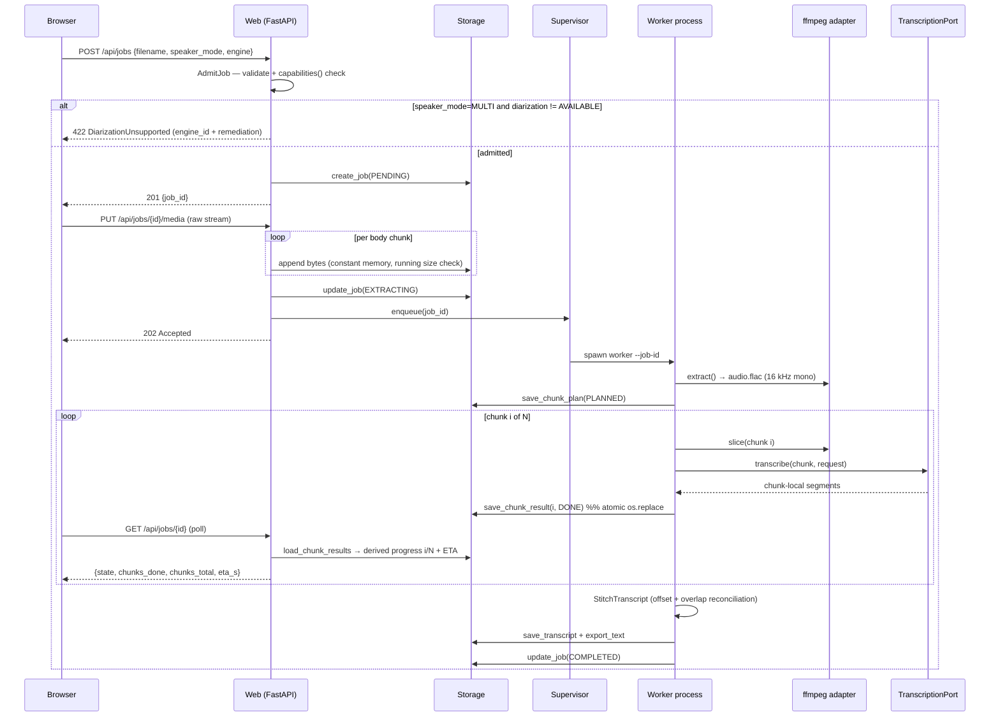
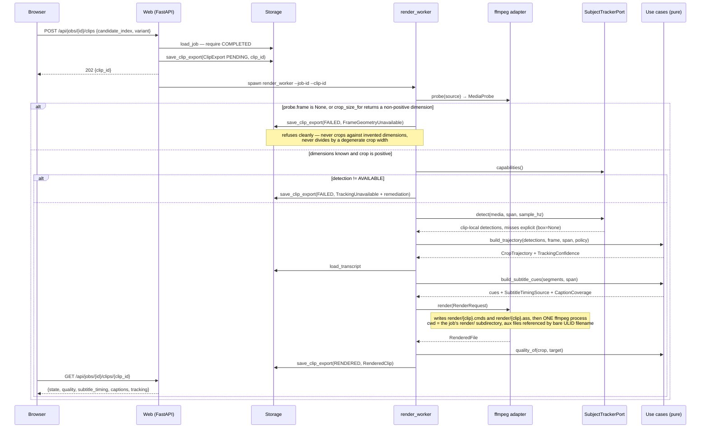

# Design: Video Transcription Pipeline

> Phase: `sdd-design` · Artifact store: hybrid (mirror of Engram `sdd/video-transcription-pipeline/design`)
> Binding input: `proposal.md` rev 3. Original verified state: greenfield, no application code, git `main` @ `d4c43b3`.
> **Rev 2 delta**: slice 1 has since shipped (`domain/`, `ports/`, `usecases/ingest_media.py`, fakes; no `adapters/`
> or `runtime/` yet), and proposal Open Question 8 was answered — music and singing are normal source input. That
> answer adds the `SegmentKind` decision below and the `TranscriptionCapabilities` membership-rule amendment.
> Deviation note: this document exceeds the 800-word design budget. The orchestrator's brief enumerates
> five port contracts, a domain model, a chunk-aware job model, two sequence diagrams, an algorithm, and
> toolchain decisions. Compressing that below 800 words would produce gestures instead of decisions.

## Technical Approach

Hexagonal core, two processes, one filesystem. The **web process** owns ingest and read-only status;
a **per-job worker process** owns extraction, chunking, transcription, stitching, and generation. They
share nothing but a per-job directory, which is the single source of truth. That split is what makes a
three-hour job survivable: the UI cannot be blocked by inference, and inference cannot be killed by a
UI restart.

The core (`domain`, `ports`, `usecases`) is synchronous and third-party-free. Async exists only in the
web adapter, with one deliberate exception (`MediaSourcePort`) justified below. Ports are `Protocol`s,
so **mypy is the enforcement mechanism for the boundary**, not decoration — there is no inheritance to
check at runtime.

## Architecture Decisions

### Decision: `typing.Protocol` for all five ports, not ABCs

| Option | Tradeoff |
| --- | --- |
| `abc.ABC` | Adapters must import and subclass the port; fakes need boilerplate; conformance checked at instantiation, so a wrong signature surfaces only when the adapter runs. |
| **`Protocol` (chosen)** | Structural: adapters and test fakes conform without importing the core. Conformance is a static check, which means it must be part of the build. |

**Rationale**: the swappability requirement is real, so the cheapest possible fake is the highest-value
property — every use-case test in the default suite is a fake behind a port. `Protocol` makes a fake a
plain class. The cost (no runtime enforcement) is paid by making `mypy` the `build_command`, which is
strictly better feedback than an `ABC` TypeError at instantiation. Ports are **not** `@runtime_checkable`:
`isinstance` on a Protocol checks method *names* only and would give false confidence.

### Decision: `TranscriptionCapabilities` admits a field only if a use case must read it

This is the subtle one. The guard against a feature-flag bag is a membership rule, stated once:

> A field belongs in `TranscriptionCapabilities` **only if a use case must read it to (a) reject a job
> before work starts, or (b) compute a chunk plan.** Anything an adapter can absorb internally — retry
> policy, model size, request concurrency, audio format preference — does not belong here.

That rule admits exactly three things today, and it is why `max_chunk_bytes` is a capability rather
than adapter trivia: the 25 MB per-request cloud cap is an *input to the planner*, not a detail the
adapter can hide.

```python
class DiarizationSupport(StrEnum):
    UNSUPPORTED    = "unsupported"     # engine can never diarize (OpenAI Whisper API)
    REQUIRES_SETUP = "requires_setup"  # engine could, this install cannot yet (pyannote absent / HF licence unaccepted)
    AVAILABLE      = "available"

class ClassificationSupport(StrEnum):
    UNSUPPORTED = "unsupported"  # engine exposes no VAD / hallucination control; output is all UNCERTAIN
    AVAILABLE   = "available"    # engine can distinguish speech from music

@dataclass(frozen=True, slots=True)
class TranscriptionCapabilities:
    engine_id: str                                  # provenance, recorded on the job record
    diarization: DiarizationSupport                 # (a) rejection rule
    non_speech_classification: ClassificationSupport # (a) admission-warning rule — see amendment below
    max_chunk_bytes: int | None                     # (b) planning rule — None = bounded only by the machine
    max_chunk_duration_s: float | None              # (b) planning rule
```

**Alternatives rejected**: `diarizes: bool` — loses the difference between *impossible* and *not
installed yet*, and those need different operator remediation ("choose another engine" vs "install
`pyannote.audio` and accept the gated licence"). A `set[str]` of feature names — a flag bag by
construction, unbounded and untypable. A `supports(feature) -> bool` query — same, plus it hides the
numeric planning limits the planner actually needs.

`capabilities()` is a **method**, not a class attribute, because the local adapter must resolve
`REQUIRES_SETUP` vs `AVAILABLE` by probing its own installation. It must be cheap, side-effect free,
and stable for the process lifetime.

**Where the check runs**: `AdmitJob` use case, at job creation — *before* upload processing completes
and before any extraction. A speaker-mode job against a non-diarizing engine fails in milliseconds,
not after an hour of audio extraction and a billed API call.

**Amendment (non-speech classification).** `non_speech_classification` does not fit the membership rule
as originally written: it neither rejects a job nor feeds the planner. Rather than smuggle it in, the
rule is **widened deliberately, once**, to:

> A field belongs in `TranscriptionCapabilities` only if a use case must read it to (a) **reject or warn
> about** a job before work starts, or (b) compute a chunk plan.

**Rationale**: rejection and warning are the same structural read — the use case must consult the
adapter *before work begins* — differing only in severity. The alternative was to carry no capability
field and let the adapter self-declare purely through its output (all `UNCERTAIN`). That was rejected
because it defers the operator's discovery until after transcription: choosing a non-classifying engine
for music-heavy footage would cost a full multi-hour run, and on the cloud path a billed one, before the
operator learns the message export is unreliable. That is precisely the failure the fail-fast admission
check exists to prevent. The widening is recorded here rather than applied silently, because the value
of this rule is that it stays narrow.

### Decision: non-speech classification is a segment property, not a filter

Source audio routinely contains a singer alongside the speaker, or music under and between spoken
passages (proposal Open Question 8). Three things follow, and the third is the one that decides the shape.

1. Whisper-family decoders **hallucinate on non-speech**: with no speech to condition on, the decoder
   falls back on a training prior saturated with subtitle tracks, emitting Spanish subtitle boilerplate
   that was never spoken. The design already acknowledged this narrowly — short tail chunks are merged
   for exactly this reason — but treated it as a chunk-geometry concern rather than a content one.
2. **Sung lyrics decode as speech.** Nothing at the ASR boundary distinguishes them from the message.
3. **The product wants both outcomes at once.** The `.txt` and the summary must contain the *message*
   only. But the operator is cutting short-form video, and the singer's moment is often the best clip in
   the footage. So the musical range must stay addressable.

(3) rules out filtering at the boundary. If non-speech is dropped where it is detected, the timestamps
go with it and the clip is unrecoverable. So: **`TranscriptSegment` carries `kind: SegmentKind`
(`SPEECH | MUSIC | UNCERTAIN`)**, every segment keeps its timestamps, and each consumer decides:

| Consumer | Policy |
| --- | --- |
| Structured `Transcript` | Keeps everything. Source of truth, unchanged in spirit. |
| `.txt` message export | `SPEECH` only. |
| Map-reduce MAP windows | `SPEECH` only — see the pollution note below. |
| Clip candidates | Any range. Timestamps are valid regardless of `kind`. |

**`UNCERTAIN` is the honest default, and it is load-bearing.** An adapter that cannot classify MUST
return `UNCERTAIN`, never `SPEECH`. Asserting "this is the message" on the basis of never having checked
is the same silent degradation as returning unlabeled segments for a diarization request, and produces
the same symptom: an artifact indistinguishable from a correct one. `UNCERTAIN` makes "I did not check"
a representable, testable state rather than an invisible one.

**Why this could not wait for slice 10.** `TranscriptSegment` is the entity that crosses every layer —
`TranscriptionPort`, the stitcher, the storage adapter, both ASR adapters, and generation. Adding a field
to it now, while `adapters/` and `runtime/` do not exist yet, touches two production files. Adding it
after slice 9 touches the stitcher, the filesystem storage adapter, both ASR adapters, the map-reduce
use case, and every test around them. This is the identical argument the proposal used to pull chunking
forward to slices 2 and 4 instead of retrofitting the job model, and it applies here with less ambiguity.

**Map-reduce pollution.** Excluding `MUSIC` from MAP windows is a correctness requirement, not a token
saving. A polluted window yields a polluted partial summary, which REDUCE folds into the final summary —
after which the contamination cannot be traced to the segment that caused it. Same failure class as the
hallucinated timestamp handled below: fluent, plausible, wrong.

### Decision: one supervised worker **process** per job (not a thread, not a queue)

| Option | Crash means | Per-chunk timeout | Verdict |
| --- | --- | --- | --- |
| Background thread in the web process | Web restart kills the job; an OOM in the model kills the UI too | **Unenforceable** — CPython cannot interrupt a thread blocked in native inference | Rejected |
| **Worker process per job (chosen)** | Web process restarts freely; worker death loses at most one in-flight chunk | Enforceable by killing the process | Chosen |
| Redis/Celery/RQ | Same as above, plus a broker daemon, serialization, and ops burden | Enforceable | Rejected — infrastructure this app does not need |

**Rationale**: this is a single-operator local app running one heavy job at a time. An external broker
buys distribution and multi-tenancy, neither of which is in scope, at the cost of a service the
operator must install and keep alive. A thread is cheaper but forfeits the two things the multi-hour
constraint demands: crash isolation and an enforceable per-chunk timeout.

Spawned with `multiprocessing.get_context("spawn")` (required on Windows, safer with native ASR libs).
Concurrency is **one running job**; further jobs stay `PENDING` in the store. Entrypoint is headless —
`python -m onevoicecut.runtime.worker --job-id <id>` — so the job model (slice 4) is complete and
testable before the web UI (slice 5) attaches the supervisor to a FastAPI lifespan hook.

**What a crash actually costs, stated plainly**: every chunk result is `os.replace`-committed as it
finishes. If the machine dies at minute 140 of a 180-minute job, the loss is the single in-flight chunk
— at most `target_chunk_seconds` (default 600 s) of work. On next startup a reconciliation pass finds
jobs in a running state with no live worker PID and marks them `INTERRUPTED`, which is the resumable
state.

**Two-level timeout**, because one level cannot cover both engines:

1. *In-call*, where the adapter can honour it — the cloud adapter sets an HTTP read timeout. Precise, cheap.
2. *Supervisory watchdog*, where it cannot — local model inference is uninterruptible, so the supervisor
   watches the newest `results/` mtime and, past `chunk_timeout_s` with no progress, terminates the worker
   and records that chunk `FAILED(TIMEOUT)`. Timeout here means **kill and resume**, not graceful cancel.
   Saying otherwise would be a lie the implementation could not keep.

### Decision: FastAPI + Uvicorn, with raw-stream upload (no multipart)

**Rationale**: ASGI gives a genuine streaming request body, which is the only property that matters for
a multi-GB upload; Pydantic validates the two per-job inputs (speaker mode, engine) at the boundary and
converts them into domain value objects; lifespan hooks host the supervisor, the startup reconciliation
pass, and the ffmpeg verification. Flask/WSGI was rejected for clumsier streaming and no boundary
validation story; bare Starlette for hand-rolled validation.

**The memory trap and its answer.** Starlette's `UploadFile` spools to memory before rolling to disk,
and multipart parsing copies through the process. A naive `await file.read()` on a 12 GB upload is an
immediate OOM. The design removes multipart entirely by splitting ingest into two requests:

| Step | Request | Body |
| --- | --- | --- |
| 1 | `POST /api/jobs` | JSON: `{filename, speaker_mode, engine, size_bytes}` → validated, capability-checked, returns `job_id` |
| 2 | `PUT /api/jobs/{job_id}/media` | Raw bytes, consumed via `async for part in request.stream()` and written straight to disk |

Constant memory, no multipart parser, and the metadata is validated *before* a single byte of a
multi-hour file is accepted. Limit enforcement is doubled: a `Content-Length` precheck against
`max_upload_bytes` (default 16 GiB), plus a running byte counter during streaming that aborts and
deletes the partial file — because `Content-Length` is client-supplied and may lie. Uvicorn imposes no
body limit of its own, so this is the only limit that exists.

### Decision: `MediaSourcePort` is the one async port; the other four are sync

The ingest path lives in the web process and must stream; the processing path lives in the worker and
blocks on inference. Rather than infect the core with `async`, the boundary is drawn at the process
edge: `MediaSourcePort` is `async` and used only by the web adapter, and the four ports the worker uses
are plain sync. **Alternative rejected**: making all ports async — it would force `asyncio` into
chunking and stitching, which are pure computation, and every fake would grow a coroutine for nothing.

### Decision: venv + pip, with split requirements files and a frozen lock

Confirming the proposal's default is correct — no `uv.lock`, `pyproject.toml`, `Pipfile`, or
`environment.yml` exists, so the `managing-python-dependencies` skill selects venv + pip. `uv` is
faster on the heavy wheels this project pulls, but it is an extra tool the operator must install for a
single-operator app that installs once. Not worth overriding a recorded decision.

**One deliberate deviation from the skill**, with rationale: a flat `pip freeze > requirements.txt`
would merge the optional heavy stacks into the base install and pin platform-specific builds, forcing
every developer to download PyTorch to run a unit test. Instead:

| File | Contents | Installed by |
| --- | --- | --- |
| `requirements.txt` | Core, hand-pinned `==`: fastapi, uvicorn, pydantic, pydantic-settings, httpx | Everyone |
| `requirements-dev.txt` | pytest, pytest-asyncio, mypy | Everyone |
| `requirements-local-asr.txt` | faster-whisper (slice 7) | Local-engine users |
| `requirements-diarization.txt` | pyannote.audio / WhisperX (slice 9) | Speaker-mode users |
| `requirements.lock.txt` | `pip freeze` output of a full install | Reproduction only |

The skill's freeze step is preserved as `requirements.lock.txt`; the four direct-dependency files stay
hand-maintained. Windows paths are `.venv\Scripts\python.exe`, not the skill's POSIX `.venv/bin/`.

**Values for `openspec/config.yaml`** (recorded here; `sdd-tasks`/`sdd-apply` write them — this phase
edits no config):

```yaml
test_command:  .venv\Scripts\python.exe -m pytest -m "not paid and not localmodel"
build_command: .venv\Scripts\python.exe -m mypy src tests
```

**Marker policy** — four markers, and the default run excludes exactly the two that cost money or time:

| Marker | Meaning | In default run |
| --- | --- | --- |
| *(none)* | Domain/use-case tests against fakes | Yes |
| `integration` | Real filesystem or ffmpeg subprocess, free and fast | Yes, but each such test skips via an `ffmpeg_available` fixture (`shutil.which("ffmpeg")`) with an explicit reason, so a machine without ffmpeg is green rather than red |
| `localmodel` | Loads real ASR/diarization weights | **No** |
| `paid` | Invokes a billed cloud API | **No** |

Markers are registered in `pytest.ini` with `--strict-markers`, so a typo'd marker is an error rather
than a silently-included paid test. This is the mechanism behind the success criterion "the default
`pytest` run invokes no paid API and no real local model".

### Decision: derived progress, never a mutable counter

`JobProgress` is computed on read by listing `results/` and comparing against the persisted `ChunkPlan`.
**Rationale**: a counter incremented in memory diverges from the truth the moment a process dies —
precisely the case this system must handle. Deriving it means progress after a crash is automatically
correct with no recovery code. ETA is `elapsed / chunks_done * (chunks_total - chunks_done)`, and is
`None` until at least one chunk completes rather than a fabricated estimate.

### Decision: single-writer rule on `job.json`

The web process and the worker both have reasons to write job state — a guaranteed race. Resolution:
while a worker is alive it is the **sole writer** of `job.json`. The web process requests cancellation
by writing a separate `control.json`, which the worker polls at chunk boundaries, and reads everything
else. Progress needs no lock at all because it is derived from a directory only the worker writes.

## Domain Model

All entities are `@dataclass(frozen=True, slots=True)`. **Rationale for immutability**: a `ChunkResult`
that can be mutated after being persisted makes resume unverifiable; state transitions produce new
`JobRecord` values that are written atomically, so the on-disk record and the in-memory record cannot
silently diverge.

**Identity**: server-generated ULIDs wrapped in `NewType` (`JobId`, `MediaId`). Never a client-supplied
filename, never a sequence number. `JobId` is validated against `^[0-9A-HJKMNP-TV-Z]{26}$` before it
ever touches a path.

**Timestamps**: `float` seconds. Every `TranscriptSegment` that leaves the stitcher carries times
**relative to the full audio track**, never to a chunk. The chunk-local → global translation happens in
exactly one place — the stitcher, immediately after the adapter returns — and this is a documented port
invariant: *`TranscriptionPort.transcribe` returns chunk-local times*. Any other choice leaks chunk
mechanics into `.txt` export and into `ClipCandidate`, which is the one thing the product outcome
depends on being correct. `float` over `timedelta` because ASR engines emit float seconds, it
round-trips through JSON without a codec, and stitching arithmetic stays readable; rounding to
milliseconds happens at export.

| Entity | Fields (shape, not exhaustive) |
| --- | --- |
| `SourceMedia` | `media_id, original_filename, stored_path, size_bytes, container, checksum` |
| `AudioTrack` | `media_id, path, duration_s, size_bytes, sample_rate=16000, channels=1, codec="flac"` |
| `ChunkPlan` | `job_id, stride_s, overlap_s, chunks: tuple[PlannedChunk, ...]` |
| `PlannedChunk` | `index, start_s, end_s` (`end_s` includes the overlap tail) |
| `AudioChunk` | `job_id, index, path, start_s, end_s, size_bytes` |
| `ChunkResult` | `job_id, index, state, segments, engine_id, attempts, error, finished_at` |
| `TranscriptSegment` | `start_s, end_s, text, speaker: str \| None, confidence: float \| None, kind: SegmentKind` |
| `Transcript` | `job_id, language="es", segments, engine_id, diarized: bool` |
| `ClipCandidate` | `start_s, end_s, hook, quote, rationale, score, variants: tuple[ScriptVariant, ...]` |
| `ScriptVariant` | `target: str, format: str, body: str, duration_target_s: float` |
| `GenerationResult` | `job_id, summary, clip_candidates` |
| `JobRecord` | `job_id, media_id, state, speaker_mode, engine, created_at, updated_at, worker_pid, error` |

`SpeakerMode` = `SINGLE | MULTI` (default `SINGLE`). `EngineChoice` = `LOCAL | CLOUD`, with **no default** —
it is a required field on the create-job request, per the binding decision that there is no global default.
`SegmentKind` = `SPEECH | MUSIC | UNCERTAIN`, **defaulting to `UNCERTAIN`** so that an adapter which
never sets it cannot accidentally assert speech — the default is the safe answer, not the common one.

`ScriptVariant.target` is a free string, and N variants comes from `settings.script_targets: list[str]`.
**Open Question 3 (which networks/formats) therefore changes a config list, not a type.**

**Job states**: `PENDING → EXTRACTING → PLANNED → TRANSCRIBING → STITCHING → GENERATING → COMPLETED`,
with `FAILED`, `CANCELLED`, and `INTERRUPTED` as off-ramps. `INTERRUPTED` exists specifically so a
crashed job is distinguishable from a failed one — only the former is resumable without operator
judgement. **Chunk states**: `PENDING | RUNNING | DONE | FAILED`.

## Interfaces / Contracts

```python
# ports/media_source.py — the one async port; used only by the web adapter
class MediaSourcePort(Protocol):
    async def store(self, media_id: MediaId, filename: str,
                    stream: AsyncIterator[bytes], max_bytes: int) -> SourceMedia: ...
        # raises UploadTooLarge, UnsupportedContainer

# ports/audio_extractor.py — ffmpeg lives behind this and nowhere else
class AudioExtractorPort(Protocol):
    def probe(self, media: SourceMedia) -> MediaProbe: ...                     # duration_s, container, has_audio
    def extract(self, media: SourceMedia, dest: Path) -> AudioTrack: ...       # → 16 kHz mono FLAC
    def slice(self, track: AudioTrack, planned: PlannedChunk, dest: Path) -> AudioChunk: ...
        # raises ExtractionFailed, FfmpegUnavailable

# ports/transcription.py
class TranscriptionPort(Protocol):
    def capabilities(self) -> TranscriptionCapabilities: ...
    def transcribe(self, chunk: AudioChunk, request: TranscriptionRequest) -> tuple[TranscriptSegment, ...]: ...
        # INVARIANT: returned times are CHUNK-LOCAL. raises TranscriptionFailed, ChunkTooLarge

@dataclass(frozen=True, slots=True)
class TranscriptionRequest:
    language: str            # "es"
    speaker_mode: SpeakerMode
    timeout_s: float | None  # honoured in-call where the adapter can; watchdog otherwise

# ports/text_generation.py — knows nothing about summaries, clips, or chunking
class TextGenerationPort(Protocol):
    def model_id(self) -> str: ...
    def complete(self, prompt: str, *, max_output_tokens: int, temperature: float = 0.2) -> str: ...
        # raises ContextLengthExceeded, GenerationFailed

# ports/transcript_storage.py — resume is built on this
class TranscriptStoragePort(Protocol):
    def create_job(self, job: JobRecord) -> None: ...
    def load_job(self, job_id: JobId) -> JobRecord: ...
    def update_job(self, job: JobRecord) -> None: ...
    def list_jobs(self) -> tuple[JobRecord, ...]: ...
    def save_chunk_plan(self, job_id: JobId, plan: ChunkPlan) -> None: ...
    def load_chunk_plan(self, job_id: JobId) -> ChunkPlan | None: ...
    def save_chunk_result(self, result: ChunkResult) -> None: ...   # MUST be atomic
    def load_chunk_results(self, job_id: JobId) -> tuple[ChunkResult, ...]: ...
    def save_transcript(self, transcript: Transcript) -> None: ...
    def load_transcript(self, job_id: JobId) -> Transcript | None: ...
    def save_artifacts(self, job_id: JobId, artifacts: GenerationResult) -> None: ...
    def export_text(self, job_id: JobId, text: str) -> Path: ...
```

`TranscriptStoragePort` is the fattest port because it is the persistence boundary of the whole job
aggregate. If it grows past this, the split line is job-record vs artifact — not sooner, since the
proposal binds five ports.

**Atomic write contract** (`save_chunk_result`): write `results/NNNN.json.tmp`, `flush` + `os.fsync`,
then `os.replace()` onto the final name. `os.replace` is used rather than `os.rename` because on
Windows `os.rename` fails when the destination exists — the exact case that occurs on a retry. A
leftover `.tmp` is ignored by the loader and overwritten. This is what makes resume correct rather
than hopeful.

## Chunk Planning and Overlap Stitching

**Planning** — the 25 MB cloud cap is expressed in bytes, but a plan is expressed in time, so the
planner bridges them using the measured bitrate of the normalized track:

```
bytes_per_second = track.size_bytes / track.duration_s
cap_s   = floor(caps.max_chunk_bytes * 0.9 / bytes_per_second) if caps.max_chunk_bytes else INF
stride_s = min(settings.target_chunk_seconds, cap_s, caps.max_chunk_duration_s or INF)
chunk i  = [i * stride_s, min(duration_s, i * stride_s + stride_s + overlap_s)]
```

The 0.9 factor is headroom for container overhead and bitrate variance. Defaults: `stride_s = 600`,
`overlap_s = 5.0`. A trailing chunk shorter than `min_chunk_seconds` (30 s) is merged into its
predecessor, because very short tail chunks are where Whisper-family models hallucinate most.

Normalizing to **16 kHz mono FLAC** is a planning decision, not just a format one: 16-bit PCM at 16 kHz
is ~1.92 MB/min, so a 25 MB request caps at ~13 minutes; FLAC on speech roughly halves that, putting a
600 s chunk near ~10 MB with substantial margin. Backstop: if an actual sliced chunk still exceeds
`max_chunk_bytes`, the adapter raises `ChunkTooLarge` and the planner splits that chunk in half and
re-slices — so a pathological bitrate degrades into more chunks, not a failed job.

**Why overlap prevents word loss**: a hard cut at instant `t` can split a word mid-phoneme, and
Whisper-family decoders additionally degrade near a truncated boundary because the attention window
loses context. With overlap, every instant of audio is decoded at least once with at least `overlap_s/2`
of context on each side, so the boundary word exists intact in at least one of the two decodes.

**Stitching** — reconciling the duplicated overlap region, deterministic, no ASR involvement:

1. Sort results by chunk index; seed the accumulator with chunk 0's segments (offset by `start_s`).
2. For chunk `k`, `boundary = plan[k].start_s`. The contested window is `[boundary, plan[k-1].end_s]`.
3. Tokenize the accumulator's tail and chunk `k`'s head inside that window: lowercase, strip
   punctuation, **preserve accents** (Spanish `si`/`sí` are different words).
4. Find the longest suffix-of-tail / prefix-of-head token match with a minimum length of 4 tokens. On a
   match, cut the accumulator at the match start and take chunk `k` from the match start onward — the
   overlap is spoken once in the output, and the version kept is the one with fuller right-context.
5. **Fallback when no match reaches the minimum** (silence, music, or a genuine disagreement): cut at the
   midpoint of the overlap window, snapped to the nearest segment boundary. Deterministic, and it can
   never lose more than `overlap_s` of audio. Note this fallback fires *often* on this material rather
   than rarely, since music in the overlap window is normal input — it is a routine path, not an
   exceptional one, and `SegmentKind` is what keeps its output out of the message.
6. A segment straddling the cut is truncated at the cut, never emitted twice; if truncation leaves it
   empty it is dropped.

**Discovered limitation — cross-chunk speaker identity.** Diarizers label speakers per invocation:
`SPEAKER_00` in chunk 3 is not necessarily `SPEAKER_00` in chunk 4. Unifying them requires voice-embedding
re-identification across chunks, which is a materially separate capability. Design response: labels are
namespaced per chunk (`c03/S00`) and `Transcript.diarized` is true, with the limitation documented for
the operator. The stitcher exposes a `SpeakerResolver` seam so a future change can unify labels without
touching the stitching algorithm. This was not covered in the proposal and is reported as a risk.

## Map-Reduce Summarization

Lives entirely in `usecases/generate_artifacts.py`, above a `TextGenerationPort` that knows nothing
about it — that is what makes an LLM provider swap an adapter-only change.

- **MAP**: window the transcript by estimated token budget (`map_window_tokens`, default 3000, 200-token
  overlap). Windows are built from `kind == SPEECH` segments only; `MUSIC` and `UNCERTAIN` are excluded
  before windowing, so lyrics never reach the model as message content. Each window is rendered with
  **segment ids**, and the model is asked to return partial summary text plus candidate moments
  referenced **by segment id**.
- **Timestamp integrity**: the LLM never emits a timestamp. It emits segment ids, which the use case
  resolves against the real `Transcript`; any id not present in the window is rejected. LLMs hallucinate
  numbers, and a fabricated timestamp would point the operator at the wrong moment in a three-hour
  video while looking entirely plausible — the same class of silent failure as undeclared diarization.
- **REDUCE**: fold partial summaries sequentially into one; rank clip candidates by model score, take
  the top `max_clip_candidates`.
- **VARIANTS**: one `complete()` call per `(clip_candidate, target)` pair. N is `len(script_targets)`.
- **Token counting without a tokenizer dependency**: the use case estimates conservatively (chars/4);
  the adapter raises `ContextLengthExceeded`, which the use case handles by halving the window and
  retrying. Provider-neutral, and keeps a tokenizer out of the core.

## Package Layout

```
src/onevoicecut/
  domain/      ids.py media.py chunking.py transcript.py jobs.py generation.py errors.py
               # zero third-party imports
  ports/       media_source.py audio_extractor.py transcription.py text_generation.py
               transcript_storage.py capabilities.py        # imports domain only
  usecases/    admit_job.py ingest_media.py plan_chunks.py transcribe_job.py
               stitch_transcript.py resume_job.py generate_artifacts.py progress.py
               # imports domain + ports only
  adapters/    web/ (FastAPI app, routers, schemas, static UI)
               ffmpeg/  asr/local/  asr/cloud/  llm/  storage/
  runtime/     settings.py engine_resolver.py supervisor.py worker.py app.py
               # composition root — the only place adapters are constructed
tests/         unit/ contract/ integration/ fakes/ fixtures/ test_architecture.py
```

Top-level names name the problem (`chunking`, `jobs`, `transcript`), not the framework. `runtime/` is
the composition root: `engine_resolver.resolve(engine: EngineChoice) -> TranscriptionPort` is the only
code that maps a per-job choice to a concrete adapter, so use cases stay engine-agnostic.

`tests/test_architecture.py` walks `src/onevoicecut/{domain,usecases,ports}` with `ast` and asserts none
of them imports `onevoicecut.adapters` or `onevoicecut.runtime`. ~15 lines, no new dependency, and it
turns the hexagonal boundary from a convention into a failing test.

## Data Flow

```
Browser ──PUT stream──► web: MediaSourcePort ──► data/jobs/{id}/source.mp4
                              │
                         job.json (PENDING)
                              │
                    Supervisor spawns worker ──► ffmpeg AudioExtractorPort ──► audio.flac
                              │                                                    │
                              │                                            PlanChunks (caps)
                              │                                                    │
                              │                              ┌──── slice ──► chunks/NNNN.flac
                              │                              │                     │
                              │                     TranscriptionPort ◄────────────┘
                              │                              │
                              │                    results/NNNN.json  (atomic, per chunk)
                              │                              │
                         reads (derived progress)     StitchTranscript ──► transcript.json/.txt
                              │                              │
                              ▼                     GenerateArtifacts ──► artifacts.json
                        GET /api/jobs/{id}                (map-reduce over TextGenerationPort)
```

Per-job directory (**Open Question 5** assumption — local filesystem, no database; a different answer
changes the `TranscriptStoragePort` adapter and one config value, not any type or use case):

```
{ONEVOICECUT_DATA_DIR}/jobs/{job_id}/
  job.json  control.json  source.<ext>  audio.flac
  chunks/NNNN.flac  results/NNNN.json
  transcript.json  transcript.txt  artifacts.json
```

### Sequence: upload to transcript



### Sequence: resume after failure

```mermaid
sequenceDiagram
    participant WK as Worker (crashed)
    participant S as Storage
    participant SUP as Supervisor
    participant WK2 as Worker (resumed)
    participant ASR as TranscriptionPort

    Note over WK: chunks 0..82 committed to results/
    WK--xWK: process dies at chunk 83 (crash, OOM, or watchdog kill)
    Note over S: results/0000..0082.json intact; 0083 absent or .tmp only

    SUP->>S: startup reconciliation — TRANSCRIBING with no live PID
    S-->>SUP: job → INTERRUPTED
    SUP->>WK2: spawn worker --job-id (resume)
    WK2->>S: load_chunk_plan + load_chunk_results
    S-->>WK2: plan(87 chunks), done={0..82}, ignore stale .tmp
    Note over WK2: work set = chunks where state != DONE → {83..86}
    loop chunk 83..86
        WK2->>ASR: transcribe(chunk)
        WK2->>S: save_chunk_result(DONE)
    end
    WK2->>WK2: StitchTranscript over all 87 results
    WK2->>S: save_transcript → COMPLETED
    Note over WK2,S: 83 completed chunks never re-transcribed; no paid call repeated
```

## Configuration and Secrets

`runtime/settings.py` — a frozen settings object loaded from environment with `.env` support
(`.env` is already gitignored; `.env.example` is committed). Settings are constructed in the composition
root only; the core never reads the environment.

| Variable | Purpose | Needed for |
| --- | --- | --- |
| `ONEVOICECUT_DATA_DIR` | Job directory root | Always |
| `ONEVOICECUT_MAX_UPLOAD_BYTES` | Upload ceiling (default 16 GiB) | Always |
| `ONEVOICECUT_TARGET_CHUNK_SECONDS` / `_CHUNK_OVERLAP_SECONDS` | Plan defaults (600 / 5.0) | Always |
| `ONEVOICECUT_CHUNK_TIMEOUT_SECONDS` | Watchdog threshold | Always |
| `ONEVOICECUT_SCRIPT_TARGETS` | Comma-separated variant targets (**Open Q3**) | Generation |
| `CLOUD_ASR_API_KEY` | Cloud adapter | `paid` tests + real cloud runs |
| `LLM_API_KEY` | Generation adapter | `paid` tests + real runs |
| `HUGGINGFACE_TOKEN` | Gated pyannote weights | Local diarization only |

Secrets are read at **adapter construction time in the resolver**, so a missing key fails fast with an
actionable message before the job starts, never mid-way through a three-hour run. Secrets never enter
`JobRecord`, never appear in logs, and never cross into the worker's argv (the worker reads its own
environment).

**Open Question 6 (retention)** — assumption: no automatic deletion. Design response: a single
`PurgeJobArtifacts(job_id, keep: set[ArtifactKind])` use case exists as a seam from the start, unused by
default. Answering Q6 wires it to a schedule or a UI action; it does not restructure anything.

## Testing Strategy

| Layer | What | Approach |
| --- | --- | --- |
| Unit | Chunk planning arithmetic, byte-cap derivation, tail merge, overlap reconciliation (match, no-match fallback, straddling segment), progress/ETA derivation, state transitions | Pure functions + frozen dataclasses, no I/O, no fakes needed |
| Unit | Use cases: admit/reject on capabilities, resume work-set selection, map-reduce folding, segment-id rejection | Fakes behind all five ports; the whole default suite |
| Unit | `SegmentKind` propagation: message export excludes `MUSIC`, MAP windows exclude non-`SPEECH`, clip candidates may still span `MUSIC` ranges, a non-classifying fake adapter yields `UNCERTAIN` and never `SPEECH` | Pure functions + fakes; no real engine needed, which is the whole point of landing it early |
| Architecture | No `domain`/`usecases`/`ports` module imports `adapters`/`runtime` | `ast` walk in `tests/test_architecture.py` |
| Contract | One shared test body run against both ASR adapters on the single-speaker path; declared divergence asserted on the diarization path per `capabilities()` | Parametrized over adapters; `localmodel` / `paid` marked |
| Integration | ffmpeg extract + slice against a tiny checked-in fixture; atomic write survives a simulated crash between `.tmp` and `os.replace` | `integration` marker, skipped when ffmpeg absent |
| E2E | Upload → `.txt` through every layer with a fake ASR; resume after a killed worker | Real HTTP client + real filesystem, fake engines only |

Strict TDD: every row above is written RED first. The fake ASR is the load-bearing test asset — it is
what allows chunking, stitching, progress, resume, and timeouts to be proven before any real engine
exists, which is precisely why the proposal reordered the slices.

## Threat Matrix

Canonical rows (VCS/PR-centric) are `N/A`; this change has no version-control or PR automation. The
boundaries that *do* exist are subprocess execution and untrusted-file classification, added below.

| Boundary | Adversarial cases | Applicability | Design response | Planned RED tests |
| --- | --- | --- | --- | --- |
| Documentation-like paths | `requirements.txt`, executable Markdown, `README.sh` | **N/A** — nothing in this change classifies or executes repository files | — | — |
| Git repository selection | `git -C`, relative/absolute paths | **N/A** — no git invocation at runtime | — | — |
| Commit state | staged, `commit -a`, empty index | **N/A** — no VCS automation | — | — |
| Push state | tracking branch, first push, refspec | **N/A** — no VCS automation | — | — |
| PR commands | `--head`, env prefix, composed commands | **N/A** — no PR automation | — | — |
| **ffmpeg subprocess argv** | Filename with `;`, `--`, `-i`, spaces, or a leading dash; path outside the job dir | **Applicable** | List-form `subprocess.run([...])`, never `shell=True`, never string interpolation. All paths are server-generated and `Path.resolve()`-checked to be inside the job directory. `-nostdin`, `-protocol_whitelist file`, explicit timeout. | Argv composition test per hostile filename; test that a path outside the job dir is rejected before spawn |
| **Uploaded-file classification** | `../../etc/passwd` filename, `.exe`/`.sh` extension, double extension, 0-byte file, non-media content with a media extension | **Applicable** | Client filename is **metadata only**, never a path component. Storage path is `jobs/{ulid}/source{ext}` with `ext` from a container allowlist. Content is validated by `ffprobe`, not by extension; no audio stream → `UnsupportedContainer`. Uploaded media is never executed and never served back. | One test per hostile filename asserting the stored path stays inside the job dir; test that a mislabeled non-media file is rejected at probe |
| **HTTP routing / path params** | `job_id` containing `..`, `/`, or a URL-encoded separator | **Applicable** | `job_id` validated against `^[0-9A-HJKMNP-TV-Z]{26}$` before any filesystem access | Traversal-attempt test per route that takes `{job_id}` |
| **Resource exhaustion at ingest** | Lying `Content-Length`, endless stream, disk full mid-upload | **Applicable** | Precheck plus a running byte counter that aborts and deletes the partial file; `OSError` on write aborts the job cleanly | Test that a stream exceeding the limit is aborted and leaves no partial file |

Applicable rows carry into `tasks.md` unchanged and are written RED before implementation.

## Slice Ordering — consistency with proposal rev 2

The rev-2 reordering (chunk planning and the chunk-aware job model before either real ASR adapter) is
**correct and this design depends on it**: the planner consumes `TranscriptionCapabilities` and
`AudioTrack` metadata as inputs, both of which a fake supplies, so slices 2 and 4 are fully provable
with no real engine. Two refinements, stated plainly rather than diverged from quietly:

1. **The diarization rejection path must move from slice 9 to slice 6.** Slice 6 introduces the
   speaker-mode input; slice 9 introduces the diarization implementations. Between them, under the
   proposal's ordering, a speaker-mode job would be accepted and silently produce unlabeled output —
   exactly the dangerous silent-degradation failure the capability mechanism exists to prevent, live in
   the repository for three slices. Every adapter therefore ships `DiarizationSupport.UNSUPPORTED` from
   slice 1 (fail-closed), the rejection lands with the option in slice 6, and slice 9 flips capable
   adapters to `AVAILABLE`.
2. **Byte-cap-aware planning belongs in slice 2, not slice 8.** Slice 8 lists "25 MB cap handling", but
   under this design the cap is consumed by the planner via `max_chunk_bytes`. Slice 2 implements and
   tests the derivation against a fake declaring `max_chunk_bytes=25_000_000`; slice 8 contributes only
   the real value and the `ChunkTooLarge` split-and-retry recovery.

Neither refinement changes slice count or the 800-line forecast materially; both move work earlier.

## Migration / Rollout

No migration — greenfield. Rollout is the proposal's ten additive slices; each ends with a green default
suite, so rollback is `git revert <slice>`. Rolling back leaves per-job directories on disk; they are
inert data, safe to delete. Prerequisite before slice 1 remains an initial commit (already satisfied by
`d4c43b3`).

## Open Questions

- [ ] **Q3 — target networks/formats for script variants.** Assumption: `script_targets` is a config list;
      N variants is structural, the list is data. Answering it changes configuration only.
- [ ] **Q5 — storage location.** Assumption: local filesystem, per-job directory, no database. Answering it
      changes the `TranscriptStoragePort` adapter and one setting, not any type or use case.
- [ ] **Q6 — retention/cleanup.** Assumption: no automatic deletion. `PurgeJobArtifacts` exists as an unused
      seam; answering it wires a trigger, not a restructure. Still the assumption most likely to become a
      real operational problem, since every job stores a multi-hour source plus audio plus chunks.
- [ ] **New — cross-chunk speaker identity.** Diarization labels are chunk-local; unifying them needs
      voice-embedding re-identification. Design ships namespaced labels plus a `SpeakerResolver` seam.
      Needs a product decision at slice 9: is per-chunk labelling acceptable for multi-speaker material?
- [ ] **New — concurrency.** One running job at a time is assumed. If the operator wants two, the
      supervisor's semaphore is the only change, but local ASR will contend for CPU/GPU.

---

# Rev 4 — Vertical Clip Rendering

> Phase: `sdd-design` (rev 4 delta) · Binding inputs: `proposal.md` rev 4, the new `specs/subject-tracking`
> (13 requirements) and `specs/clip-rendering` (10), the two appended `transcript-artifacts` requirements
> (`Word-Level Timing`, `Word-Level Timing Is Consistent With Overlap Stitching`), and the appended
> `audio-extraction` requirement (`Media Probe Reports Frame Dimensions`).
> **Verified state at writing**: slices 1–6 are shipped and green — 511 tests, 0 skipped, mypy clean over
> 104 files; `domain/`, `ports/`, seven use cases, `adapters/{ffmpeg,storage,web}`, `runtime/` and
> `tests/fakes/` all exist. Package is `onevoicecut`, not the `transcribe` used in the rev 1–3 text above.
> **Nothing above this line is re-opened.** Every rev 1–3 decision is load-bearing on shipped code; this
> section only *extends* them. Where a rev-4 decision touches a shipped mechanism (the storage codec, the
> stitcher, `TranscriptionCapabilities`, `argv.py`) the extension is stated as a delta against the exact
> shipped behaviour, never as a replacement.
> Deviation note, restated for rev 4: this section exceeds the 800-word design budget for the same reason
> the rev 1–3 document did. The brief enumerates a retrofit through five layers, three port contracts, a
> six-stage geometry pipeline, an ffmpeg filter-graph attack surface, and a placement verdict. Compressing
> that below 800 words would produce gestures instead of decisions.

## Rev-4 Technical Approach

Rendering does not change the shape of the system; it adds a **second, short branch off a completed job**.
Transcription is a multi-hour pipeline that ends at `COMPLETED`. A render is a minutes-long operation over
a few minutes of that same source, triggered afterwards by an explicit operator selection (proposal Open
Question 13). The two share the job directory and nothing else.

The rev-4 shape is the rev-1 shape applied twice more:

```
detection (weights, slow, marked)  →  arithmetic (pure, default suite)  →  native pass (ffmpeg, one process)
     SubjectTrackerPort                    plan_trajectory                        VideoRenderPort
```

That is the same split that let chunk planning and stitching be proven before either ASR engine existed,
and it is the reason `CropTrajectory` is a domain object rather than a private variable inside a renderer:
everything easy to get wrong — jitter, a crop leaving the frame, a gap in detections, "did we actually
track anything" — is arithmetic over a list of keyframes, and arithmetic runs in the default suite.

Five rev-4 decisions exist only to keep a *fourth, fifth, sixth, seventh and eighth* silent-degradation
axis from opening. Rev 1–3 established three (diarization, `SegmentKind`, and the `UNCERTAIN` default).
Rev 4 adds: word timing that is empty rather than fabricated, keyframe provenance, subtitle-timing
provenance, caption coverage, and the native-vs-upscaled quality declaration. All five share one shape:
*the artifact looks fine*.

## Decision: `WordTiming` is an additive, defaulted, never-nullable field

This is the highest-risk item in rev 4 and it is decided as five separate sub-decisions, because bundling
them is how a retrofit goes wrong.

### 1. Optional vs required — required on the type, defaulted to empty

```python
# domain/transcript.py
@dataclass(frozen=True, slots=True)
class WordTiming:
    start_s: float
    end_s: float
    text: str          # VERBATIM as the engine emitted it, leading space and punctuation included

@dataclass(frozen=True, slots=True)
class TranscriptSegment:
    start_s: float
    end_s: float
    text: str
    speaker: str | None
    confidence: float | None
    kind: SegmentKind = SegmentKind.UNCERTAIN
    words: tuple[WordTiming, ...] = ()      # rev 4 — additive, defaulted, NEVER None
```

| Option | Tradeoff | Verdict |
| --- | --- | --- |
| `words: tuple[WordTiming, ...] \| None` | `None` and `()` would both mean "no word timing here". Two representations of one fact, and every consumer needs a `None` branch that is indistinguishable in behaviour from the empty branch. | Rejected |
| `words: tuple[WordTiming, ...]` **required, no default** | Honest, but breaks all 15 `TranscriptSegment(...)` construction sites at once and gives a non-word-timing adapter nothing to write but `()` anyway. | Rejected |
| **`words: tuple[WordTiming, ...] = ()` (chosen)** | The spec's "explicitly empty" *is* the honest value, so the safe default and the absent value coincide — exactly as `kind` defaults to `UNCERTAIN`. Zero of the 15 shipped construction sites change. | **Chosen** |

**Rationale**: the retrofit's measured blast radius is much smaller than the proposal feared, and this
decision is why. `TranscriptSegment(...)` is constructed in exactly 15 places across 10 files (1 in `src/`
— the storage codec — and 14 in tests, most of them factories). A trailing defaulted field is source- and
behaviour-compatible with every one of them. **What is expensive is not the field. It is the stitcher and
the codec**, and those are decided below.

`None` is unrepresentable, so "the adapter cannot do word timing" and "this MUSIC segment has no words"
are the same value `()`. That is correct: the difference between them is a property of the *adapter*, not
of the segment, and it is carried by the capability declaration.

### 2. What a segment from a non-word-timing engine looks like

`words=()`, always, and the adapter declares `WordTimingSupport.UNSUPPORTED`. Never an evenly-distributed
estimate. The design response that makes this testable rather than aspirational is a **port invariant**:

> **INVARIANT (word timing)**: when `segment.words` is non-empty,
> `"".join(w.text for w in segment.words) == segment.text`.
> The adapter owns both fields and MUST make them consistent. Word times are **chunk-local**, on the same
> terms as `start_s`/`end_s` — the stitcher is the only place they become track-relative.

This invariant is load-bearing three ways: it makes the stitcher able to rebuild text from surviving words
without inventing spacing (sub-decision 4); it is a single assertion in the shared contract suite that
catches an adapter fabricating word boundaries (a fabricated set will not reconstruct the text); and it
forces cloud adapters that return bare word strings to *choose* — normalise both fields into agreement, or
declare `UNSUPPORTED`. There is no third option in which they quietly disagree.

**Alternative rejected**: word entries as `(offset, length)` index ranges into `segment.text`. More precise
on paper, but every consumer would slice strings, and any downstream normalisation of `text` silently
invalidates every offset. The failure would be off-by-a-few captions with no error — the exact failure
class this document exists to close.

### 3. Capability declaration — admitted by the *existing* rule, with no further widening

```python
# ports/capabilities.py
class WordTimingSupport(StrEnum):
    UNSUPPORTED = "unsupported"   # engine emits no word boundaries at all
    AVAILABLE   = "available"

@dataclass(frozen=True, slots=True)
class TranscriptionCapabilities:
    engine_id: str
    diarization: DiarizationSupport
    non_speech_classification: ClassificationSupport
    word_timing: WordTimingSupport          # rev 4 — required, no default
    max_chunk_bytes: int | None
    max_chunk_duration_s: float | None
```

The membership rule (widened once, deliberately, in rev 2) reads: *a field belongs here only if a use case
must read it to (a) **reject or warn about** a job before work starts, or (b) compute a chunk plan.*
`word_timing` satisfies clause (a) **as already written** — `AdmitJob` warns when the operator selects an
engine with no word timing, because burned-in captions are now the product outcome and learning after a
three-hour run that captions will be segment-level is precisely the wasted-run failure that justified the
rev-2 widening. **The rule is not widened again**, and this is recorded because the rule's whole value is
that it stays narrow.

Two members, not three: unlike `DiarizationSupport` there is no `REQUIRES_SETUP` state, because
`faster-whisper`'s `word_timestamps=True` uses cross-attention alignment over weights already loaded — no
extra download, no gated licence. Mirroring `ClassificationSupport` is the honest shape.

### 4. Stitcher — word dedup happens in the same pass, keyed on the same cut

The spec's new obligation. The shipped stitcher cuts on a **time**, and words carry times, so dedup is
already expressible in the existing algorithm without a second matching pass. Three changes to
`usecases/stitch_transcript.py`, all local:

```python
def _shift(segment: TranscriptSegment, offset: float) -> TranscriptSegment:
    return replace(
        segment,
        start_s=segment.start_s + offset,
        end_s=segment.end_s + offset,
        words=tuple(
            replace(w, start_s=w.start_s + offset, end_s=w.end_s + offset)
            for w in segment.words
        ),
    )

def _split_words(segment: TranscriptSegment, cut: float, *, keep: str) -> TranscriptSegment | None:
    """Partition a straddling segment's words by WORD START ONLY.

    Total and disjoint: every word lands on exactly one side of the cut, so a word
    straddling the cut is neither duplicated nor lost. The segment's own times are then
    DERIVED FROM THE SURVIVING WORDS rather than from the cut, and its text is rebuilt by
    concatenation, which the word-timing invariant makes lossless.
    """
    kept = tuple(w for w in segment.words if (w.start_s < cut if keep == "before" else w.start_s >= cut))
    if not kept:
        return None                                   # drop, per the docstring that could not be honoured before
    return replace(
        segment,
        start_s=kept[0].start_s,
        end_s=kept[-1].end_s,
        words=kept,
        text="".join(w.text for w in kept),
    )
```

`_clip_before` and `_clip_after` call `_split_words` **only when `segment.words` is non-empty**; when it is
empty they keep today's exact time-truncation behaviour. That is what makes this change additive: a
transcript from a non-word-timing engine stitches byte-for-byte as it does today, so the shipped stitcher
tests stay green unchanged and the new tests are purely additive.

| Consequence | Statement |
| --- | --- |
| **Bought** | No orphaned `WordTiming` at a seam, and no lost word timing for a word that survives — both spec scenarios, closed by construction rather than by a post-pass. |
| **Paid** | The two segments sharing a seam may overlap by less than one word's duration (~0.3 s), because each keeps the whole of any word it owns. **Text is never duplicated**, which is the property the spec binds; the sub-word timestamp overlap is real audio the speaker said once. |
| **Made true** | `_clip_before`'s existing docstring says "drop it if empty". Today nothing can drop, because text is never truncated. With words, an empty survivor set drops the segment — the comment stops being aspirational. |

**Alternative rejected**: re-align words against the stitched text after the fact, by tokenising both.
That re-derives what the adapter already knows and must guess whenever the alignment is ambiguous — which
is fabrication of word boundaries, the exact thing the spec forbids on this axis.

**Alternative rejected**: dedup words by matching word *text* runs independently of the segment cut. Two
matchers on one seam can disagree, and then text and timing describe different cuts. One cut, one
partition.

### 5. Storage codec — one tolerated absence, and only one

`adapters/storage/serialization.py` encodes with `asdict`, which already recurses into nested frozen
dataclasses, so **the encoder needs no change at all**: `words` serialises as a list of objects for free.
Decoding is the decision.

The shipped `_segment` reads `kind` strictly and rejects an absent key as `CorruptedRecord`, with a stated
reason: *"a stored segment always carries a kind, so an absent one is a broken file, not an unclassified
one."* That reason was true because `SegmentKind` landed as slice 1b, **before any file could exist**. It
is false for `words`: `results/NNNN.json` files written by shipped slices 1–6 exist on disk right now and
legitimately lack the key.

| Option | Tradeoff | Verdict |
| --- | --- | --- |
| Strict, mirroring `kind` | Consistent, but makes every pre-slice-11 chunk result unreadable — resume of an in-flight job would fail as `CorruptedRecord` after the upgrade, which is the one operation the atomic-write contract exists to protect. | Rejected |
| A `schema_version` field on every record | General, but adds a version to every encoder and every decoder to carry one additive field, in a codec that has no versioning today. Machinery ahead of need. | Rejected |
| **Absent key → `()`; present-but-malformed → `CorruptedRecord` (chosen)** | Strictness stays exactly where it detects corruption. Leniency applies only to an absence that encodes a real historical fact, and resolves to the honest empty value rather than a guess. | **Chosen** |

```python
def _word_timings(record: Record) -> tuple[WordTiming, ...]:
    # The ONE tolerated absence in this codec, and it is tolerated for a dated reason:
    # chunk results written before slice 11 exist on disk and predate the field. Absent
    # resolves to the honest empty value — the same value a non-word-timing adapter writes —
    # so tolerating it fabricates nothing. A key that is PRESENT but not a list of objects is
    # still a broken file.
    if "words" not in record:
        return ()
    return tuple(
        WordTiming(
            start_s=_number(item, "start_s"),
            end_s=_number(item, "end_s"),
            text=_text(item, "text"),
        )
        for item in _objects(record, "words")
    )
```

RED tests this implies: a pre-slice-11 fixture payload (no `words` key) decodes with `words == ()`;
`"words": "hello"` raises `CorruptedRecord`; `"words": [{"start_s": true, ...}]` raises `CorruptedRecord`;
and the spec's round-trip scenario — a segment persisted with `()` is retrieved with `()`, never a
fabricated one.

## Decision: `MediaProbe.frame` is one nullable pair, not two nullable ints

```python
# domain/media.py
@dataclass(frozen=True, slots=True)
class FrameSize:
    width: int
    height: int

@dataclass(frozen=True, slots=True)
class MediaProbe:
    duration_s: float
    container: str
    has_audio: bool
    frame: FrameSize | None = None      # rev 4 — None means DECLARED ABSENT, never "unknown, assume 1080p"
```

| Option | Tradeoff | Verdict |
| --- | --- | --- |
| `width: int \| None` + `height: int \| None` | Four states for a two-state fact. `width=1920, height=None` is representable and meaningless, and every consumer must handle it. | Rejected |
| Sentinel `FrameSize(0, 0)` | Absence becomes arithmetic — a division by zero somewhere far from the probe instead of a refusal at the boundary. | Rejected |
| **`frame: FrameSize \| None` (chosen)** | Absence is one fact, checked once. `mypy` forces every consumer to narrow before touching geometry, which is the spec's "refuse cleanly" made structural. | **Chosen** |

Consumers refuse with a new domain error, `FrameGeometryUnavailable(DomainError)` — not
`UnsupportedContainer`, because the container is fine; it simply carries no video.

**Two ffprobe parsing guards, both of which fail silently if omitted.** The shipped `probe()` already reads
`payload["streams"]`; extracting dimensions from it has two traps worth naming:

1. **Attached cover art is a video stream.** An audio file with embedded artwork reports a `video` stream
   of, say, 500×500. Selecting the first `codec_type == "video"` stream would report a square "frame" for
   an audio-only source and hand the trajectory planner a fabricated geometry that no consumer could
   detect. **Guard**: skip streams with `disposition.attached_pic == 1`; if none survives, `frame = None`.
2. **Rotation metadata makes coded size differ from display size.** A file with a `displaymatrix` side-data
   rotation of ±90° stores 1920×1080 but *displays* 1080×1920. ffmpeg auto-rotates on decode, so the filter
   graph sees display geometry — a crop computed against coded geometry would crop the wrong axis and look
   like a framing bug rather than a metadata bug. **Guard**: read the rotation from `side_data_list` and
   swap width/height when it is ±90°, so `FrameSize` is **always display geometry**.

Unlikely on a fixed church camera, cheap to add, and silent when wrong — which is the whole reason to add
it now rather than after the first misframed clip.

**`MediaProbe` is not persisted.** The renderer re-probes. `ffprobe` on a local file is milliseconds and
idempotent, the source is already in the job directory, and storing a second copy of derived metadata
creates a staleness question for no gain. This is why the frame-dimension delta needs **no storage change,
no codec change, and no migration** — it is genuinely small, and that matters for the split recommendation
below.

### Placement verdict: `sdd-spec` was right — CONFIRMED, not overturned

The frame-dimension requirement stays in `specs/audio-extraction/spec.md`. Three reasons, in order of
weight:

1. **The contract that changes is `AudioExtractorPort.probe()`.** A capability owns the port whose contract
   it binds. `media-ingest` owns the HTTP boundary and the two per-job inputs; it does not own container
   inspection and never has — `Content type is validated by ffprobe, never by extension` already lives on
   the extraction side.
2. **The code that changes is `adapters/ffmpeg/extractor.py`.** ffmpeg lives behind `AudioExtractorPort`
   and nowhere else. Putting the requirement in `media-ingest` would create a spec whose only possible
   implementation is in another capability's adapter.
3. **`media-ingest` has an active reason not to grow this.** It is the capability whose scenarios enforce
   that the web layer stores bytes without interpreting them (extensionless `source`, filename as metadata
   only). Adding "and reports the video's pixel dimensions" to that capability blurs exactly the boundary
   its own tests defend.

**Recorded smell, deliberately not fixed**: the capability is named `audio-extraction` and now specifies a
video-geometry field. `media-extraction` would be the better name. Renaming rewrites a shipped spec file,
its heading references, and the archive report for zero behavioural gain, and every rename is a chance to
lose a requirement in transit. The name is imprecise; the placement is correct. Leave it.

## Decision: three new ports, and what each is forbidden to know

```python
# ports/capabilities.py  (rev 4 additions)
class DetectionSupport(StrEnum):
    UNSUPPORTED    = "unsupported"     # this build can never track (no vision adapter compiled in)
    REQUIRES_SETUP = "requires_setup"  # adapter present, weights or requirements-vision.txt absent
    AVAILABLE      = "available"

@dataclass(frozen=True, slots=True)
class TrackerCapabilities:
    tracker_id: str
    detection: DetectionSupport

@dataclass(frozen=True, slots=True)
class RenderCapabilities:
    renderer_id: str
    vertical_render: RenderSupport      # UNSUPPORTED | REQUIRES_SETUP | AVAILABLE (ffmpeg absent)
```

Three members for `DetectionSupport` and not two, because the operator remediation genuinely differs:
"choose another tracker" versus "`pip install -r requirements-vision.txt` and let the weights download".
That is the same argument `DiarizationSupport` made, and the same conclusion.

**The duplication between `DiarizationSupport`, `DetectionSupport` and `RenderSupport` is deliberate.** A
shared `SupportLevel` enum would be shorter and would couple four independent axes to one vocabulary,
which is the first step toward inferring one from another — the thing every axis in this system explicitly
forbids. Four small enums cost twelve lines and make "never infer one axis from the other" a type-level
fact.

```python
# ports/subject_tracker.py — answers "where is the person", nothing more
@dataclass(frozen=True, slots=True)
class BoundingBox:
    x: int
    y: int
    width: int
    height: int

@dataclass(frozen=True, slots=True)
class SubjectDetection:
    at_s: float                 # CLIP-LOCAL, mirroring TranscriptionPort's chunk-local invariant
    box: BoundingBox | None     # None is an EXPLICIT MISS, never a centered guess
    confidence: float | None    # set on a hit; a low-confidence HIT still carries a box

class SubjectTrackerPort(Protocol):
    def capabilities(self) -> TrackerCapabilities: ...
    def detect(
        self, media: SourceMedia, span: TimeSpan, *, sample_hz: float
    ) -> tuple[SubjectDetection, ...]:
        """INVARIANT: `at_s` is CLIP-LOCAL and every sample lies within `span`.

        Raises TrackingUnavailable, DetectionFailed.
        """
        ...
```

`box=None` versus a low-confidence hit is the spec's "the no-detection result MUST be distinguishable from
a low-confidence true detection", made structural: a miss has no box to inspect, a weak hit has one.
Whether a weak hit is *good enough* is a policy question, and policy lives in the use case, never in the
detector.

**Coordinates are clip-local, and the reason is mechanical, not aesthetic.** The port takes a
source-absolute `span` (it must seek in the source file) and returns clip-local times — exactly the pairing
already shipped between `AudioExtractorPort.slice` (plan-absolute in) and `TranscriptionPort.transcribe`
(chunk-local out). It is also the coordinate the render pass needs: `-ss` placed before `-i` resets output
timestamps to zero, so every `sendcmd` timestamp and every subtitle cue is clip-local by construction. One
translation point, in the trajectory use case, and nothing downstream re-offsets.

```python
# ports/video_render.py — knows nothing about WHY the trajectory says what it says
@dataclass(frozen=True, slots=True)
class RenderRequest:
    media: SourceMedia                       # the only media input that exists
    span: TimeSpan                           # source-absolute
    trajectory: CropTrajectory               # clip-local keyframes, already decided
    cues: tuple[SubtitleCue, ...]            # clip-local, derived from this job's transcript
    target: OutputSpec                       # width, height, crf, preset
    dest: Path                               # server-generated, inside the job directory

@dataclass(frozen=True, slots=True)
class RenderedFile:
    path: Path
    size_bytes: int
    duration_s: float

class VideoRenderPort(Protocol):
    def capabilities(self) -> RenderCapabilities: ...
    def render(self, request: RenderRequest) -> RenderedFile:
        """Raises RenderFailed, FfmpegUnavailable."""
        ...
```

**`RenderRequest` is the design response to the "rendered content originates only from the source"
requirement, and it answers it with a type rather than a check.** The request has no field capable of
carrying an external image, audio track, video asset, font file, or overlay. There is nothing to validate
at runtime because there is nothing to pass. The spec scenario ("its inputs MUST consist only of the source
media, a `CropTrajectory` computed from that same source, and subtitle cues derived from that same
source's transcript") is closed by construction, and the RED test that proves it is a structural one — the
same shape as the shipped test asserting no `UploadFile` import exists anywhere in `adapters/web`, and for
the same reason: an absence cannot be proven by a request.

```python
# ports/publish.py — DECLARED, deliberately unimplemented (proposal Open Question 11)
class PublishPort(Protocol):
    def capabilities(self) -> PublishCapabilities: ...
    def publish(self, export: ClipExport) -> PublishReceipt: ...
```

`PublishPort` exists in this design for exactly one purpose: to keep `ClipExport` from becoming hostile to
it. Three constraints on `ClipExport` follow, and each would be expensive to discover later:

| Constraint on `ClipExport` | Why a future publisher needs it |
| --- | --- |
| It is a **value**, JSON-round-trippable through the existing codec — never an open file handle or a live object. | A publisher may run in a different process, minutes or days later. A handle cannot survive that; a `Path` plus metadata can. |
| It carries **everything a post needs**: clip path, title, description, the `ScriptVariant` used, source `start_s`/`end_s`, the quality declaration, and the tracking confidence. | Otherwise a publisher would have to re-open the transcript and the trajectory to build a caption — which is a reshape, not an added adapter. |
| It carries **nothing a publisher owns**: no credentials, no account ids, no scheduling, no per-network fields. | Exactly as ASR API keys live in the resolver and never in `JobRecord`. A per-network field on a domain export makes Open Question 3 structural, which the rev-1 design deliberately kept as data. |

Nothing else about publishing is designed. `PublishReceipt` and `PublishCapabilities` are named so the
Protocol type-checks; their contents are the future change's problem.

## Decision: trajectory planning is a six-stage pure pipeline, and the order is load-bearing

```python
# usecases/plan_trajectory.py
def build_trajectory(
    detections: tuple[SubjectDetection, ...],
    frame: FrameSize,
    span: TimeSpan,
    policy: TrajectoryPolicy,
) -> CropTrajectory: ...
```

`TrajectoryPolicy` is a frozen value from settings: `aspect_w=9`, `aspect_h=16`, `smoothing_window_s=1.0`,
`dead_zone_fraction=0.04` (of frame width), `max_gap_s=1.5`, `max_fallback_ratio=0.5`, `punch_in=1.0`.

| # | Stage | What it does | Why it is here and not elsewhere |
| --- | --- | --- | --- |
| 1 | **Crop size** | Computed **once** for the whole clip, by the definition and derivation immediately below this table. No clamping and no re-evening step: the derivation's postcondition already puts both dimensions inside the frame. | Even dimensions because H.264 requires them. Constant because a per-keyframe crop size would make "native vs upscaled" vary *within one clip* and therefore undeclarable as one fact. |
| 2 | **Centres** | Each hit's `box` → desired crop centre (box centre, horizontally; vertically the crop is full-height so `y` is fixed). | Pure geometry over the detector's output. Misses carry no desired centre and are simply absent from stages 3–5. |
| 3 | **Smooth** | Centred moving average of `smoothing_window_s` over the **tracked subsequence only**. | Averaging across misses would drag the centre toward whatever the miss was replaced with — which is how a "smoothed" trajectory silently walks off the subject. |
| 4 | **Dead-zone** | Forward hysteresis: hold the last committed `x` until `abs(desired - held) > dead_zone_fraction * frame.width`, then commit. | **After** smoothing, never before. Raw jitter trips a dead-zone repeatedly; smoothed drift trips it once. Reversing stages 3 and 4 produces a crop that twitches at exactly the threshold. |
| 5 | **Clamp** | `x = min(max(x, 0), frame.width - crop_w)`, same for `y`. | **Last** among the position stages, so nothing after it can push the rect out of frame. |
| 6 | **Fill** | A run of misses bounded by `TRACKED` on **both** sides and lasting `<= max_gap_s` → linear interpolation between the two bounding committed rects, origin `INTERPOLATED`. Every other run — leading, trailing, or longer than `max_gap_s` — → centred rect, origin `FALLBACK_CENTER`. | Both fill methods preserve the clamp invariant without re-clamping: the frame is convex, both endpoints are inside it, so every point on the segment between them is inside it, and a centred rect is inside by construction. |

#### `even()` is defined, and its direction is the reason the clamp is safe

`even()` is the load-bearing rounding operator of this whole subsystem, so it is defined once, here, and
nowhere restated informally:

```python
def even(value: float) -> int:
    """Round DOWN to the nearest even integer. Total, and no tie case exists."""
    return 2 * math.floor(value / 2)


def crop_size_for(frame: FrameSize, policy: TrajectoryPolicy) -> tuple[int, int]:
    if frame.width * policy.aspect_h >= frame.height * policy.aspect_w:   # frame is 9:16 or wider
        crop_h = even(frame.height)
        crop_w = even(crop_h * policy.aspect_w / policy.aspect_h)
    else:                                                                 # frame is narrower than 9:16
        crop_w = even(frame.width)
        crop_h = even(crop_w * policy.aspect_h / policy.aspect_w)
    return crop_w, crop_h
```

**Direction is down, always; there is no tie behaviour to specify** because `floor` is total. Rounding *up*
was the alternative and it is unsafe: on an odd frame width `even()` would return `frame.width + 1`, making
`frame.width - crop_w` **negative** and inverting stage 5's clamp — `min(max(x, 0), -1)` yields `-1`, a
crop rect starting outside the frame, which is exactly what *Clamping to Frame Edges* exists to prevent.
The removed "re-evened after clamping" step had the same defect from the other side: re-evening upward can
push a clamped `crop_w` back above `frame.width`. Neither step is needed.

**Postcondition, which stages 5 and 6 depend on**: `crop_w <= frame.width` and `crop_h <= frame.height`,
both even and **non-negative**. Proof: `even(v) <= v`, `even` is monotone, and `even(v) >= 0` for
`v >= 0`. In the first branch `crop_h <= frame.height` directly, and
`crop_w <= crop_h * 9/16 <= frame.height * 9/16 <= frame.width` by the branch condition; the second branch
is the same argument with the axes swapped. So `frame.width - crop_w >= 0` and
`frame.height - crop_h >= 0`, and stage 5's clamp is well-formed. `12a.8` pins this postcondition as a
property, not only the two worked examples.

**Positivity is NOT part of the postcondition, and pretending it was is what an earlier revision got
wrong.** `even(v) = 0` for every `v` in `[0, 2)`, so a degenerate frame produces a degenerate crop:
`FrameSize(1920, 1)` takes the first branch and yields `crop_h = even(1) = 0`, hence `crop_w = 0`. The
proof above still holds — `0 <= 1` — but `OutputQuality.factor = target_width / crop_width` is then a
`ZeroDivisionError`, not a declaration. No amount of rounding fixes this: a 1-pixel-tall frame has no
9:16 crop.

**So it is refused, at the boundary, not repaired in the arithmetic.** `crop_size_for` stays total and
keeps returning what the geometry actually gives; the render worker treats a non-positive `crop_w` or
`crop_h` exactly as it treats absent dimensions, failing the clip with `FrameGeometryUnavailable` before
the tracker is called (the first `alt` branch of the sequence diagram below, which covers both cases).
Deriving a minimum frame size instead would need a different threshold per branch — the first branch
needs `frame.height >= 4`, the second `frame.width >= 2` — and a caller comparing against the wrong one
is precisely the arithmetic error being guarded. Testing the computed result is total and needs no
threshold. `quality_of` is therefore **undefined only where the refusal has already fired**: every crop
reaching it has positive dimensions by construction.

Confidence is computed once, on the finished trajectory: `fallback_ratio = count(FALLBACK_CENTER) / total`,
and `TrackingConfidence.LOW_CONFIDENCE` when it exceeds `max_fallback_ratio` (0.5 = "predominantly", per
the spec's wording). `INTERPOLATED` counts as *well tracked*, because the spec's own scenario says a
trajectory predominantly `TRACKED` **or** `INTERPOLATED` is not flagged. Because it is a field on
`CropTrajectory`, it is available **before** rendering — the spec requires exactly that, and the
alternative (deriving it at render time) would make it observable only after the file exists.

### Decision: the trajectory is built at detection rate; densification belongs to the adapter

This is the trap in this subsystem, and it is worth naming. Detection is expensive, so it samples at
`sample_hz` (default 4). `sendcmd` holds a commanded value until the next command, so smooth motion needs
commands at roughly frame rate (`command_hz`, default 25). Naively resampling the *trajectory* up to 25 Hz
would mark ~84% of its keyframes `INTERPOLATED` — collapsing the tracked ratio and flagging every
trajectory low-confidence, on a purely cosmetic resampling.

| Option | Tradeoff | Verdict |
| --- | --- | --- |
| Densify in the use case, mark fills `INTERPOLATED` | Destroys the confidence signal. The provenance axis stops meaning anything. | Rejected |
| Densify in the use case, propagate the left keyframe's origin | Keeps the ratio honest but inflates `CropTrajectory` to ~1,500 keyframes for a 60 s clip, all of which must be persisted and serialised. | Rejected |
| **Densify in the ffmpeg command-file writer (chosen)** | `CropTrajectory` stays 1:1 with detection samples, so provenance and the tracked ratio mean exactly what they say. | **Chosen** |

Does adapter-side densification violate *"the renderer MUST NOT recompute smoothing, dead-zone, or
clamping"*? No, and the reason is one line: **linear interpolation between two already-committed rects
introduces no decision, and by convexity every densified rect lies inside the frame.** No smoothing
parameter, no threshold, and no clamp is consulted. It is a rendering-fidelity detail, not a geometric
re-decision — and the densifier lives in a **pure** module (`adapters/ffmpeg/sendcmd.py`), tested in the
default suite with no ffmpeg, exactly as `argv.py` is today.

## Decision: one native pass via `sendcmd` from a generated command file

| Option | Tradeoff | Verdict |
| --- | --- | --- |
| `crop=x='if(between(t,..),..)'` piecewise expression | The whole trajectory becomes one argv token, thousands of characters long, in a syntax that must be composed by string concatenation — the one construction this project's threat matrix bans everywhere else. | Rejected |
| `zoompan` | Built for panning stills; awkward frame-rate semantics on video and no clean per-time addressing. | Rejected |
| Decode → per-frame crop in Python → encode | Pipes raw frames across a process boundary. The spec forbids it outright, and it is 1–2 orders of magnitude slower. | Rejected |
| **`sendcmd=f=<file>` driving `crop` (chosen)** | Native, single process, and the trajectory leaves argv entirely — it lives in a generated file inside the job directory. Only `x` and `y` are commanded, because stage 1 fixed the crop size. | **Chosen** |

The filter graph and argv, extending `adapters/ffmpeg/argv.py` rather than inventing a second approach —
`_ffmpeg_prefix()` and `resolve_inside()` are reused **verbatim**, so the shipped threat-matrix rows keep
covering the new path:

```
ffmpeg -nostdin -hide_banner -loglevel error -protocol_whitelist file
       -ss <clip_start>                        # BEFORE -i: seek the container, not decode 3 hours to reach it
       -i <absolute source path>
       -t <clip duration>
       -filter_complex "[0:v]sendcmd=f=<CLIP_ID>.cmds,crop=w=<CW>:h=<CH>:x=0:y=0,
                        scale=<TW>:<TH>:flags=lanczos,subtitles=<CLIP_ID>.ass[v]"
       -map [v] -map 0:a:0
       -c:v libx264 -preset medium -crf 20 -pix_fmt yuv420p
       -c:a aac -b:a 128k
       -movflags +faststart
       -y <absolute dest path>
```

`-ss` before `-i` is the same decision `build_slice_argv` already made and for the same reason; the bonus
here is that it zeroes the output timestamps, which is what makes clip-local coordinates correct end to
end rather than merely convenient.

### The one genuinely new attack surface: a filter graph IS parsed

`argv.py`'s safety rests on a fact that stops being true inside `-filter_complex`: *nothing parses the
tokens*. A filter graph is parsed, with its own escaping rules for `:`, `,`, `'`, `\` and `[`/`]` — and on
Windows every absolute path contains a drive colon, so `subtitles=C:\...\x.ass` is malformed before any
hostile input is involved. Documented escaping for this is three layers deep and famously fragile.

**Design response — containment, not escaping.** ffmpeg is spawned with `cwd` set to **the job's `render/`
subdirectory** — the directory the two auxiliary files are written to, itself `resolve_inside`-checked
against the job directory — and they are referenced in the graph by **bare relative filename**:
`<CLIP_ID>.cmds` and `<CLIP_ID>.ass`, where `CLIP_ID` is a server-generated ULID validated against
`^[0-9A-HJKMNP-TV-Z]{26}$` before the graph is composed. A name drawn from that alphabet contains no
character with meaning in a filter graph, so **the escaping problem is deleted rather than solved**.

`cwd` is `render/` and not the job directory precisely so that no `render/` prefix — and therefore no path
separator — is ever needed inside the graph. A separator would reintroduce the escaping problem the ULID
alphabet exists to delete, on Windows with a backslash, which the graph parser reads as an escape
character. Input and output paths stay absolute in argv, where absoluteness already guarantees no leading
dash and nothing parses the token.

Setting `cwd` needs a runner that accepts it. The shipped `ProcessRunner` protocol is
`__call__(argv, timeout_s)`, and widening it would force every existing extractor fake to grow a parameter
it will never use. Instead the renderer declares its **own** `RenderProcessRunner` protocol with a `cwd`
parameter — four lines, structural typing means one real `subprocess.run` wrapper satisfies both, and zero
shipped code changes.

### Decision: ASS, not SRT, for burn-in

Burned-in social captions need explicit styling — font, size, outline, bottom-third margin, alignment.
SRT carries none of it, so the styling would have to travel as `force_style=...` **inside the filter
graph**, creating a second injection surface whose values the operator can tune. ASS carries styling in
the file, which keeps the graph a fixed shape with two ULID filenames in it. The `.ass` is generated by
`adapters/ffmpeg/subtitles.py` (pure, default suite) from `tuple[SubtitleCue, ...]`.

**ASS text needs escaping, and the text is model output.** Cue text comes from an ASR engine, and an ASR
engine can emit `{`, `}`, `\` or a newline. In ASS, `{...}` is an inline override block and a raw newline
terminates the dialogue line — so a hallucinated brace silently changes the styling of the rest of the
clip, or truncates a caption. Response: neutralise `{`/`}`, escape `\`, strip CR/LF, and emit intentional
line breaks only as `\N`. One RED test per hostile string, in the default suite, with no ffmpeg.

## Decision: the four declarations are computed above the port, not reported by the adapter

`VideoRenderPort.render` returns a thin `RenderedFile`. The use case `usecases/render_clip.py` assembles
the operator-facing `RenderedClip`:

```python
# domain/rendering.py
class OutputQualityKind(StrEnum):
    NATIVE   = "native"
    UPSCALED = "upscaled"

@dataclass(frozen=True, slots=True)
class OutputQuality:
    kind: OutputQualityKind
    factor: float          # target_width / crop_width; <= 1.0 is NATIVE
                           # defined only for crop_width > 0 — a degenerate crop is
                           # refused as FrameGeometryUnavailable before quality_of runs

class SubtitleTimingSource(StrEnum):
    WORD_LEVEL    = "word_level"
    SEGMENT_LEVEL = "segment_level"

class CaptionCoverage(StrEnum):
    # ONE basis for all three members: the ELIGIBLE SEGMENTS in the span, never the cues.
    # Cue construction is total over that set (see "the eligibility rule, stated once"),
    # so "no eligible segment" and "zero cues" are the same condition, not two.
    CONFIRMED_SPEECH    = "confirmed_speech"     # every eligible segment in the span was SPEECH
    INCLUDES_UNVERIFIED = "includes_unverified"  # at least one eligible segment was UNCERTAIN
    NONE                = "none"                 # the span carried no eligible segment

@dataclass(frozen=True, slots=True)
class RenderedClip:
    clip_id: ClipId
    job_id: JobId
    path: Path
    source_start_s: float
    source_end_s: float
    quality: OutputQuality
    subtitle_timing: SubtitleTimingSource
    captions: CaptionCoverage
    tracking: TrackingConfidence
```

**Rationale**: none of the four declarations is an observation of ffmpeg's output. All four are known
*before the spawn* — quality from `FrameSize` and `OutputSpec`, subtitle timing from whether the clip's
segments carried words, caption coverage from those segments' `SegmentKind`, tracking confidence from the
trajectory. Letting the adapter report them would put pure arithmetic behind an `integration` marker, which
is precisely the trade the hexagon exists to refuse (the proposal's own phrasing, applied to a new axis).
It would also make the adapter capable of lying about a value it did not compute.

The arithmetic, in `domain/framing.py` as module functions beside `crop_size_for`, mirroring how
`render_message_text` lives beside its entities:

```
4K   3840x2160 → crop_h = even(2160) = 2160, crop_w = even(2160 * 9/16) = even(1215.0) = 1214
                 → 1214x2160, factor 1080/1214 = 0.89 → NATIVE
1080p 1920x1080 → crop_h = even(1080) = 1080, crop_w = even(1080 * 9/16) = even(607.5)  =  606
                 →  606x1080, factor 1080/606  = 1.78 → UPSCALED x1.78
```

**These are the authoritative numbers**: `1214x2160` and `606x1080`. Both are derived from the single
`even()` definition above rather than asserted, in a function `13a.11` pins. Rev 4's proposal originally
carried `1215x2160` and `608x1080` — the first is not even at all and the second rounds the wrong way; both
have been corrected in `proposal.md`, `specs/clip-rendering/spec.md` and `tasks.md` so one number appears
everywhere. The declarations they feed are unchanged: `0.89` NATIVE on 4K, `1.78` UPSCALED on 1080p.

### Which segments become cues: the eligibility rule, stated once

An earlier revision left this implicit and contradicted itself three ways in six lines. It is a
`SegmentKind` policy decision, and this project takes those explicitly.

**Rule: the eligible set is `without_music(segments overlapping the span)`, minus any segment whose text is
empty once stripped.** One selector, used by the quantifier, by cue construction, and by both declarations
— there is no second set anywhere.

**And cue construction is total over that set**: every eligible segment yields **at least one** cue —
word-boundary splitting yields one or more, and the word-less fallback yields exactly one at segment times.
The empty-text exclusion removes the clearest case of an eligible segment that contributes
nothing. **Totality is not proven.** A segment overlapping the span in a region containing none
of its words stays eligible and still yields no cue, so `CONFIRMED_SPEECH` on a clip carrying
zero cues is reachable. Whether eligibility needs a minimum-overlap rule is open, and slice 13a
is where it is decided — that is the first unit that builds a cue set from a real span.

| Kind | Becomes a cue? | Why |
| --- | --- | --- |
| `MUSIC` | **No** | `without_music`'s docstring already fixes this for every message-facing consumer: *"Drop sung and instrumental audio. Never the message."* Burning sung lyrics into the frame would make the clip caption something the preacher did not say. The segment keeps its timestamps and stays addressable as clip material — marked, never filtered, exactly as `SegmentKind` requires. |
| `UNCERTAIN` | **Yes** | Excluding it yields **zero captions on every engine shipping today**: `ports/capabilities.py` has no classifying adapter yet, so a non-classifying engine marks the whole transcript `UNCERTAIN`. That is the same all-uncertain-renders-as-empty failure `render_message_text` refuses, arriving on the caption channel, where it is worse: a muted vertical clip whose only text channel is silently blank. |
| `SPEECH` | **Yes** | The ordinary case. |

**`UNCERTAIN_MARKER` is not burned into the frame.** `[?] ` is a reader affordance in a text file an
operator reads; in a 9:16 caption it is noise a viewer cannot act on, and on a non-classifying engine it
would prefix *every* line. The uncertainty is declared **once, structurally**, on `RenderedClip.captions`
instead of per-line in pixels — which is why `CaptionCoverage` exists and why it is the fourth declaration
rather than a rendering detail. The marking rule stays fixed per kind, never decided per segment, matching
`render_message_text`'s stated discipline.

**The empty cue set is declared, not silent.** When the span contains no eligible segment — a clip
candidate over a song, which is a real and permitted case — cue construction yields zero cues and
`captions = NONE`. By totality the converse holds too: zero cues is reachable *only* that way. The `.ass`
is still written and the filter graph keeps its fixed shape, because an ASS file with no dialogue lines is
valid; the operator learns "this clip is deliberately uncaptioned" from structured metadata rather than by
watching it. `NONE` is never reachable through a *failure* to caption, only through the absence of
anything eligible to caption.

Subtitle timing is decided where the decision is made — `usecases/build_subtitle_cues.py` returns
`(cues, timing_source, coverage)`. A clip is `WORD_LEVEL` only when **every eligible segment** — the same
set, not "every speech segment" — carries non-empty `words`; otherwise `SEGMENT_LEVEL`. Quantifier and
construction set now coincide, which is what makes the declaration true rather than merely plausible. With
zero eligible segments the declaration is `SEGMENT_LEVEL`: vacuous truth would report `WORD_LEVEL` for a
clip that has no words at all, and the conservative value is the one that cannot overclaim.

This is deliberately computed from the actual segments and not from `capabilities().word_timing`: even a
word-timing-capable adapter can return `()` for some segment, so the capability answers "could this engine
ever", while the clip's own eligible segments answer "did this clip get it". Only the second is true about
the artifact. (The `MUSIC` case that motivated the old wording is now excluded by eligibility before the
quantifier ever sees it, so it no longer has to be explained away.)

Cue construction: take the eligible segments overlapping the span, restrict to the span, and split each
into cues of at most `max_cue_chars` (default 42, two lines) at **word boundaries using word times**. With
no words, one cue per segment at segment times — never an even distribution across the segment's duration,
which is the fabrication the spec names explicitly.

## Decision: a render is a separate short-lived worker, and render state lives per clip

| Option | Tradeoff | Verdict |
| --- | --- | --- |
| Extend `JobState` with `RENDERING`/`RENDERED` | Touches the shipped state machine, the storage codec's `JobState` decode, the progress derivation and the status route — and makes a job with three rendered clips and one failed render unrepresentable. | Rejected |
| Render inline in the web request | Minutes-long ffmpeg pass inside an HTTP request. The rev-1 design already rejected this shape for transcription and the reasoning is unchanged. | Rejected |
| **A second entrypoint, `python -m onevoicecut.runtime.render_worker --job-id <id> --clip-id <id>` (chosen)** | Same spawn mechanism, same headless-first testability, and `JobState` is untouched — slices 11–13 ship **no state-machine migration**. | **Chosen** |

The **single-writer rule holds without a new mechanism**: a render only starts on a `COMPLETED` job, so the
transcription worker is already dead, and the render worker writes only `render/{clip_id}.json` — never
`job.json`. Render state is `ClipState = PENDING | RENDERING | RENDERED | FAILED` on `ClipExport`, and N
clips per job each carry their own, which is the representation the rejected option could not express.

Guards in `usecases/render_clip.py`, before any spawn: `0 <= start_s < end_s <= probe.duration_s`, and
`end_s - start_s <= max_clip_seconds` (default 180) → `ClipRangeInvalid`. The render timeout is
`max(60.0, 20 * clip_duration_s)` — two orders of magnitude tighter than extraction's four-hour ceiling,
because a clip is minutes and a render that has run twenty times realtime is hung, not slow.

## Decision: `TranscriptStoragePort` grows by two methods; the pre-committed split is deferred

The rev-1 design pre-committed: *"if it grows past this, the split line is job-record vs artifact."* That
line is now due, and it is deliberately not taken yet.

| Option | Tradeoff | Verdict |
| --- | --- | --- |
| Split into `JobStatePort` + `ArtifactStoragePort` now | Correct eventually, and it means a ninth port plus rewriting the filesystem adapter, the fake, and every construction site across shipped slices 1–6 — **in the same slice range that already carries the `WordTiming` retrofit through the same adapter**. Two simultaneous retrofits through one file is how a 4x overrun becomes an 8x one. | Deferred |
| **Add `save_clip_export` / `load_clip_exports` (chosen)** | A clip export *is* part of the job aggregate, so the port is still the persistence boundary it claims to be. Two methods, one codec pair, no reshape. | **Chosen** |

**Recorded trigger for the deferred split**: when a *third* artifact family arrives (publishing receipts is
the obvious candidate), split then. Logged as a rev-4 open question so it is a decision with a date rather
than a slow drift.

## Rev-4 Domain Model Additions

All new entities are `@dataclass(frozen=True, slots=True)`, consistent with every entity above.

| Module | Additions |
| --- | --- |
| `domain/ids.py` | `ClipId` (`NewType`), `make_clip_id` — same ULID family and same regex validation as `JobId`, because it becomes a filename component. |
| `domain/media.py` | `FrameSize`; `MediaProbe.frame: FrameSize \| None = None`. |
| `domain/transcript.py` | `WordTiming`; `TranscriptSegment.words: tuple[WordTiming, ...] = ()`. |
| `domain/framing.py` **(new)** | `TimeSpan`, `CropRect`, `KeyframeOrigin` (`TRACKED \| INTERPOLATED \| FALLBACK_CENTER`), `CropKeyframe`, `CropTrajectory`, `TrackingConfidence`, `TrajectoryPolicy`; module functions `crop_size_for(frame, policy)` and `quality_of(crop, target)`. |
| `domain/rendering.py` **(new)** | `SubtitleCue`, `SubtitleTimingSource`, `CaptionCoverage`, `OutputSpec`, `OutputQuality`, `OutputQualityKind`, `RenderedClip`, `ClipExport`, `ClipState`. |
| `domain/errors.py` | `FrameGeometryUnavailable`, `TrackingUnavailable`, `DetectionFailed`, `RenderFailed`, `ClipRangeInvalid` — all deriving from `DomainError`, all raised across a port boundary. |

`CropTrajectory` carries **the first `__post_init__` invariant in the domain**: every keyframe's rect must
share one `width`/`height`. Justified because the renderer's fixed `crop=w=..:h=..` depends on it, and a
violated invariant would otherwise surface as a corrupt filter graph inside a subprocess rather than a
caught `ValueError` in the default suite. The alternative — letting the adapter refuse a mixed-size
trajectory — pushes a domain invariant into an adapter and behind an `integration` marker.

## Rev-4 Data Flow

```
job COMPLETED ──► operator selects a ClipCandidate ──► POST /api/jobs/{id}/clips
                                                              │
                                                     ClipExport(PENDING) written
                                                              │
                                        spawn render_worker --job-id --clip-id
                                                              │
                            ┌─────────────────────────────────┼──────────────────────────────┐
                            ▼                                 ▼                              ▼
                  AudioExtractorPort.probe            SubjectTrackerPort.detect       load_transcript
                     → MediaProbe.frame                  → detections (clip-local)      → segments
                            │                                 │                              │
                            └──────────────┬──────────────────┘                              │
                                           ▼                                                 ▼
                                    plan_trajectory                                 build_subtitle_cues
                            (crop size, smooth, dead-zone,                    (eligible = without_music;
                             clamp, fill, confidence)                      word-level or declared segment-
                                                                         level fallback; caption coverage)
                                           │                                                 │
                                           └────────────────┬────────────────────────────────┘
                                                            ▼
                                                  render/{clip}.cmds + .ass
                                                            │
                                                  VideoRenderPort.render
                                            (ONE ffmpeg process, cwd = job dir/render)
                                                            │
                                                  render/{clip}.mp4
                                                            │
                                          RenderedClip assembled ABOVE the port
                             (quality + subtitle timing + caption coverage + tracking)
                                                            │
                                                  render/{clip}.json  (ClipExport RENDERED)
```

Job directory, extending the rev-1 layout with one subdirectory:

```
{ONEVOICECUT_DATA_DIR}/jobs/{job_id}/
  job.json  control.json  source  audio.flac
  chunks/NNNN.flac  results/NNNN.json
  transcript.json  transcript.txt  artifacts.json
  render/{clip_id}.cmds  {clip_id}.ass  {clip_id}.mp4  {clip_id}.json
```

### Sequence: selected candidate to exported vertical clip



The two `alt` branches are the design's whole answer to "the artifact looks fine": both refuse *before*
ffmpeg is spawned, and both record a remediation string rather than producing a plausible file.

## Rev-4 Threat Matrix

The shipped rows (ffmpeg subprocess argv, uploaded-file classification, HTTP path params, ingest
exhaustion) remain **Applicable and unchanged** — the render path reuses `_ffmpeg_prefix()`,
`resolve_inside()` and the ULID route guard verbatim, which is the point of extending `argv.py` rather
than writing a second composer. Four new rows:

| Boundary | Adversarial cases | Applicability | Design response | Planned RED tests |
| --- | --- | --- | --- | --- |
| **ffmpeg filter-graph composition** | A job-directory path containing `:` (every Windows drive letter), `'`, `,`, `\` or `[`; a clip id that is not a ULID reaching the graph | **Applicable — new in rev 4.** Unlike argv, a filter graph *is* parsed. | `cwd` set to the job's `render/` subdirectory (`resolve_inside`-checked against the job directory), which is where the aux files are written, so they are referenced by **bare relative ULID filename** with no directory prefix; that alphabet contains no graph metacharacter; `clip_id` validated against the ULID regex before composition. Escaping is deleted, not solved. | Graph composition under a job dir path containing `:`/`'`/`,`; a non-ULID `clip_id` refused before spawn; assert the composed graph contains no absolute path **and no path separator** |
| **ASS subtitle content injection** | Transcript text containing `{\an8}`, `}`, a lone `\`, `\r\n`, or a 5,000-character hallucinated run | **Applicable — new in rev 4.** Cue text is ASR output, and ASR output is model output. | Neutralise `{`/`}`, escape `\`, strip CR/LF, emit intended breaks only as `\N`; cue length bounded by `max_cue_chars`. Pure function, default suite. | One test per hostile string asserting the emitted dialogue line is a single line with no override block |
| **Render resource exhaustion** | A clip span of three hours; `end_s` past the source duration; a negative or inverted span; an ffmpeg process that hangs | **Applicable — new in rev 4.** | `0 <= start_s < end_s <= probe.duration_s` and `end_s - start_s <= max_clip_seconds` → `ClipRangeInvalid` before spawn; render timeout `max(60, 20 * duration)`; `-ss` before `-i` so a late clip does not decode the whole source. | Each invalid span rejected before any spawn; timeout surfaces as `RenderFailed`, never `TimeoutExpired` |
| **Vision adapter decode** | A multi-hour source handed to the tracker; whole-span frame buffering; `ffmpeg \| python` raw-frame pipe | **Applicable — new in rev 4.** | Decode **in-process** (no subprocess pipe of raw frames, per the binding constraint), sequentially over the clip span only, downscaled to ≤640 px, evaluating every Nth frame and releasing each. Cost is bounded by clip length, never source length. | Tracker asked for a span longer than `max_clip_seconds` refuses; `localmodel`-marked test asserts detection covers only the requested span |

Applicable rows carry into `tasks.md` unchanged and are written RED before implementation.

## Rev-4 Testing Strategy

| Layer | What | Approach |
| --- | --- | --- |
| Unit | `WordTiming` round-trip: absent key decodes `()`; malformed `words` raises `CorruptedRecord`; `()` persists and returns `()` | Pure codec tests, no filesystem — the module is already pure by design |
| Unit | Stitcher lockstep: a boundary word's timing appears exactly once; no orphaned entry after a cut; a word-less transcript stitches byte-identically to today | Pure functions over fixtures; the last case is the regression guard for the whole retrofit |
| Contract | The word-timing invariant `"".join(w.text) == segment.text` on both ASR adapter families | Added to the existing shared contract body; `localmodel` / `paid` marked |
| Unit | Trajectory: jitter is smoothed; sub-threshold movement does not move the crop; supra-threshold does; a rect near an edge is clamped inside; a bounded short gap is `INTERPOLATED`; a leading gap and an over-long gap are `FALLBACK_CENTER`; a predominantly-fallback trajectory is `LOW_CONFIDENCE` and a predominantly-tracked one is not | Fake detector, **no vision weights** — the success criterion rev 4 was most likely to break |
| Unit | `crop_size_for` / `quality_of`: 3840×2160 → `1214×2160` → NATIVE 0.89; 1920×1080 → `606×1080` → UPSCALED 1.78; both dimensions even; the postcondition `crop_w <= frame.width and crop_h <= frame.height` over odd frame dimensions; a source narrower than 9:16 | Pure arithmetic, the one authoritative pair of numbers pinned |
| Unit | `MediaProbe.frame`: dimensions read; attached cover art does not become a frame; ±90° rotation swaps to display geometry; absence is `None`; a consumer refuses with `FrameGeometryUnavailable` | ffprobe JSON fixtures — no ffmpeg needed, the parse is already isolated |
| Unit | Cue building: a multi-second segment splits at word boundaries; a word-less segment yields `SEGMENT_LEVEL` and never an even distribution; `WORD_LEVEL` only when every **eligible** segment has words; `MUSIC` never becomes a cue while keeping its timestamps; an all-`UNCERTAIN` span still produces cues, unmarked in-frame, and declares `INCLUDES_UNVERIFIED`; an all-`MUSIC` span yields zero cues and declares `NONE`; totality — a whitespace-only segment is not eligible, so `NONE` holds if and only if the cue set is empty | Pure, default suite |
| Unit | ASS escaping and `sendcmd` densification | Pure modules beside `argv.py`, the shipped precedent |
| Architecture | `domain`/`usecases`/`ports` still import no `adapters`/`runtime` after three new ports and three new use cases | The shipped `ast` walk, unchanged and not weakened |
| Structural | `RenderRequest` has no field able to carry an external asset | Same shape as the shipped "no `UploadFile` in `adapters/web`" test — an absence cannot be proven by a request |
| Integration | A real ffmpeg render of a tiny fixture produces a 9:16 file with the commanded crop and visible burned-in text; graph composition under a path containing `:` | `integration` marker, skipped when ffmpeg is absent |
| Contract | The real vision tracker returns explicit misses and never a synthesised centre | `localmodel` marked, excluded from the default run |

## Rev-4 Slice Ordering — three units become seven

The proposal's slices 11–13 (~1,700 estimated lines) are re-planned against the measured 4.0x multiplier
and the 800-line budget. **Slice 11 must split, and the split also reorders.**

| Unit | Contents | Blocks | Note |
| --- | --- | --- | --- |
| **11a** | `FrameSize`, `MediaProbe.frame`, the two ffprobe guards, `FrameGeometryUnavailable`, refusal path | 12a | Small and independent. **No storage change, no codec change, no migration** — because the probe is re-run rather than persisted. |
| **11b** | `WordTiming`, capability axis, codec tolerance, stitcher lockstep, contract invariant | the subtitle half of 13a | The retrofit. Shares **zero files** with 11a. |
| **12a** | `domain/framing.py` entities + `__post_init__` invariant, `SubjectTrackerPort`, `TrackerCapabilities`, fake detector | 12b | |
| **12b** | The six-stage pipeline + confidence | 13b-iii | The one estimate with real grounding — pure logic, like the well-measured 2a/2b. |
| **13a** | `VideoRenderPort`, `RenderRequest`, pure `render_argv`/`sendcmd`/`subtitles` modules, cue building, quality arithmetic | 13b | No ffmpeg executed. All arithmetic, all default suite. |
| **13b** | The real ffmpeg renderer, `render_worker`, `ClipExport` storage, HTTP clip routes, integration test | — | |
| **13c** | The real vision tracker adapter | — | `localmodel` only. Needs 12a's port and 13b-i's `max_clip_seconds` for its span refusal; independent of the rest of 13b. |

**11a and 11b must not ship as one unit.** They share no file, no type and no test; they were bundled in
the proposal only because both are "domain gaps rendering exposed". Bundled, they land as one ~1,600-line
review in which a two-line entity addition is buried under a five-layer retrofit — and 11a is the one that
unblocks slice 12, so bundling delays the whole geometry track behind the riskiest change in rev 4.

## Rev-4 Open Questions

- [ ] **Q11 — publishing.** Unchanged: out of scope, `PublishPort` declared. This design constrains
      `ClipExport` to keep the flip an added adapter rather than a reshape. Flipping it also falsifies the
      rollback clause *"no external state is mutated"*, which is the real cost.
- [ ] **Q13 — which candidates render.** Assumption taken as designed: the operator selects, rendering is
      explicit, and render state lives per `ClipExport` rather than in `JobState`. If the answer becomes
      "render all", the change is a loop in the web layer and a concurrency limit — not a state machine.
- [ ] **New — `TranscriptStoragePort` split, deferred with a trigger.** Two methods added now; split at the
      job-record/artifact line when a third artifact family arrives.
- [ ] **New — punch-in factor is unmeasured.** `TrajectoryPolicy.punch_in` defaults to 1.0 (no punch-in)
      because proposal Open Question 12 records that how large the preacher is within the wide frame has
      never been measured. On the 1080p path a punch-in multiplies an already 1.78x upscale, so the default
      must stay 1.0 until someone measures a real frame.
- [ ] **New — `command_hz` is a guess.** 25 Hz is chosen as "about frame rate" without `MediaProbe`
      carrying frame rate, which the spec did not require. If stepping is visible on 50/60 fps footage, the
      fix is either raising the constant or adding `fps` to `MediaProbe` — a second, separate probe delta.
- [ ] **New — caption coverage is settled by declaration, with a trigger.** Cue eligibility is
      `without_music` and `UNCERTAIN` is captioned unmarked, declared once via `RenderedClip.captions`.
      That is a decision, not an open question — but it was taken while **no classifying engine exists**,
      so `INCLUDES_UNVERIFIED` is currently the only outcome any real engine can produce. Revisit once
      slices 7–8 ship a classifying adapter and the value starts discriminating: if `INCLUDES_UNVERIFIED`
      then becomes rare, a per-cue treatment may be worth the pixels it costs. Unlike the slice-10a
      `speech_segments` question, this one has a stated default that is safe to ship.
- [ ] **Open Question 9 sharpens again.** Whether musical ranges are *promoted* as clip candidates is now a
      question about the most shareable artifact the system can produce. Still a ranking-policy decision in
      slice 10b, still changes no type — but rev 4 raised its value.
