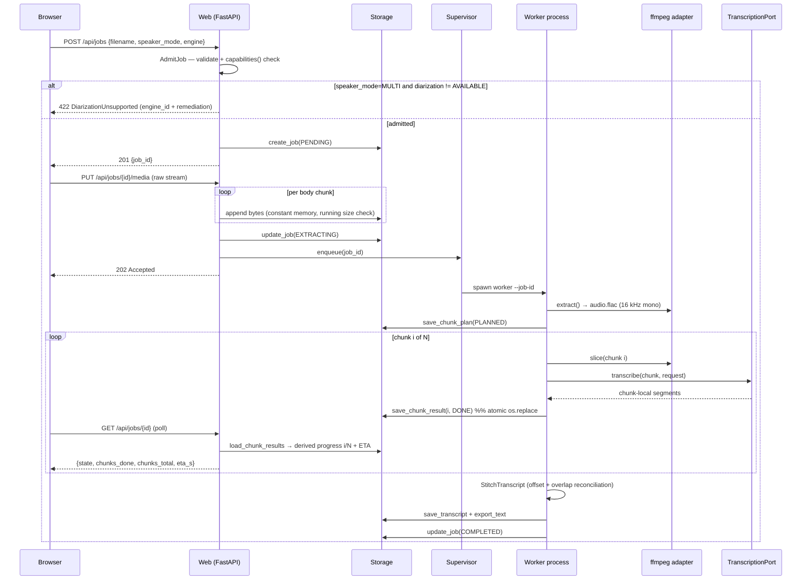

# Design: Video Transcription Pipeline

> Phase: `sdd-design` · Artifact store: hybrid (mirror of Engram `sdd/video-transcription-pipeline/design`)
> Binding input: `proposal.md` rev 2 (Engram 643). Verified state: greenfield, no application code, git `main` @ `d4c43b3`.
> Deviation note: this document exceeds the 800-word design budget. The orchestrator's brief enumerates
> five port contracts, a domain model, a chunk-aware job model, two sequence diagrams, an algorithm, and
> toolchain decisions. Compressing that below 800 words would produce gestures instead of decisions.

## Technical Approach

Hexagonal core, two processes, one filesystem. The **web process** owns ingest and read-only status;
a **per-job worker process** owns extraction, chunking, transcription, stitching, and generation. They
share nothing but a per-job directory, which is the single source of truth. That split is what makes a
three-hour job survivable: the UI cannot be blocked by inference, and inference cannot be killed by a
UI restart.

The core (`domain`, `ports`, `usecases`) is synchronous and third-party-free. Async exists only in the
web adapter, with one deliberate exception (`MediaSourcePort`) justified below. Ports are `Protocol`s,
so **mypy is the enforcement mechanism for the boundary**, not decoration — there is no inheritance to
check at runtime.

## Architecture Decisions

### Decision: `typing.Protocol` for all five ports, not ABCs

| Option | Tradeoff |
| --- | --- |
| `abc.ABC` | Adapters must import and subclass the port; fakes need boilerplate; conformance checked at instantiation, so a wrong signature surfaces only when the adapter runs. |
| **`Protocol` (chosen)** | Structural: adapters and test fakes conform without importing the core. Conformance is a static check, which means it must be part of the build. |

**Rationale**: the swappability requirement is real, so the cheapest possible fake is the highest-value
property — every use-case test in the default suite is a fake behind a port. `Protocol` makes a fake a
plain class. The cost (no runtime enforcement) is paid by making `mypy` the `build_command`, which is
strictly better feedback than an `ABC` TypeError at instantiation. Ports are **not** `@runtime_checkable`:
`isinstance` on a Protocol checks method *names* only and would give false confidence.

### Decision: `TranscriptionCapabilities` admits a field only if a use case must read it

This is the subtle one. The guard against a feature-flag bag is a membership rule, stated once:

> A field belongs in `TranscriptionCapabilities` **only if a use case must read it to (a) reject a job
> before work starts, or (b) compute a chunk plan.** Anything an adapter can absorb internally — retry
> policy, model size, request concurrency, audio format preference — does not belong here.

That rule admits exactly three things today, and it is why `max_chunk_bytes` is a capability rather
than adapter trivia: the 25 MB per-request cloud cap is an *input to the planner*, not a detail the
adapter can hide.

```python
class DiarizationSupport(StrEnum):
    UNSUPPORTED    = "unsupported"     # engine can never diarize (OpenAI Whisper API)
    REQUIRES_SETUP = "requires_setup"  # engine could, this install cannot yet (pyannote absent / HF licence unaccepted)
    AVAILABLE      = "available"

@dataclass(frozen=True, slots=True)
class TranscriptionCapabilities:
    engine_id: str                       # provenance, recorded on the job record
    diarization: DiarizationSupport      # (a) rejection rule
    max_chunk_bytes: int | None          # (b) planning rule — None = bounded only by the machine
    max_chunk_duration_s: float | None   # (b) planning rule
```

**Alternatives rejected**: `diarizes: bool` — loses the difference between *impossible* and *not
installed yet*, and those need different operator remediation ("choose another engine" vs "install
`pyannote.audio` and accept the gated licence"). A `set[str]` of feature names — a flag bag by
construction, unbounded and untypable. A `supports(feature) -> bool` query — same, plus it hides the
numeric planning limits the planner actually needs.

`capabilities()` is a **method**, not a class attribute, because the local adapter must resolve
`REQUIRES_SETUP` vs `AVAILABLE` by probing its own installation. It must be cheap, side-effect free,
and stable for the process lifetime.

**Where the check runs**: `AdmitJob` use case, at job creation — *before* upload processing completes
and before any extraction. A speaker-mode job against a non-diarizing engine fails in milliseconds,
not after an hour of audio extraction and a billed API call.

### Decision: one supervised worker **process** per job (not a thread, not a queue)

| Option | Crash means | Per-chunk timeout | Verdict |
| --- | --- | --- | --- |
| Background thread in the web process | Web restart kills the job; an OOM in the model kills the UI too | **Unenforceable** — CPython cannot interrupt a thread blocked in native inference | Rejected |
| **Worker process per job (chosen)** | Web process restarts freely; worker death loses at most one in-flight chunk | Enforceable by killing the process | Chosen |
| Redis/Celery/RQ | Same as above, plus a broker daemon, serialization, and ops burden | Enforceable | Rejected — infrastructure this app does not need |

**Rationale**: this is a single-operator local app running one heavy job at a time. An external broker
buys distribution and multi-tenancy, neither of which is in scope, at the cost of a service the
operator must install and keep alive. A thread is cheaper but forfeits the two things the multi-hour
constraint demands: crash isolation and an enforceable per-chunk timeout.

Spawned with `multiprocessing.get_context("spawn")` (required on Windows, safer with native ASR libs).
Concurrency is **one running job**; further jobs stay `PENDING` in the store. Entrypoint is headless —
`python -m transcribe.runtime.worker --job-id <id>` — so the job model (slice 4) is complete and
testable before the web UI (slice 5) attaches the supervisor to a FastAPI lifespan hook.

**What a crash actually costs, stated plainly**: every chunk result is `os.replace`-committed as it
finishes. If the machine dies at minute 140 of a 180-minute job, the loss is the single in-flight chunk
— at most `target_chunk_seconds` (default 600 s) of work. On next startup a reconciliation pass finds
jobs in a running state with no live worker PID and marks them `INTERRUPTED`, which is the resumable
state.

**Two-level timeout**, because one level cannot cover both engines:

1. *In-call*, where the adapter can honour it — the cloud adapter sets an HTTP read timeout. Precise, cheap.
2. *Supervisory watchdog*, where it cannot — local model inference is uninterruptible, so the supervisor
   watches the newest `results/` mtime and, past `chunk_timeout_s` with no progress, terminates the worker
   and records that chunk `FAILED(TIMEOUT)`. Timeout here means **kill and resume**, not graceful cancel.
   Saying otherwise would be a lie the implementation could not keep.

### Decision: FastAPI + Uvicorn, with raw-stream upload (no multipart)

**Rationale**: ASGI gives a genuine streaming request body, which is the only property that matters for
a multi-GB upload; Pydantic validates the two per-job inputs (speaker mode, engine) at the boundary and
converts them into domain value objects; lifespan hooks host the supervisor, the startup reconciliation
pass, and the ffmpeg verification. Flask/WSGI was rejected for clumsier streaming and no boundary
validation story; bare Starlette for hand-rolled validation.

**The memory trap and its answer.** Starlette's `UploadFile` spools to memory before rolling to disk,
and multipart parsing copies through the process. A naive `await file.read()` on a 12 GB upload is an
immediate OOM. The design removes multipart entirely by splitting ingest into two requests:

| Step | Request | Body |
| --- | --- | --- |
| 1 | `POST /api/jobs` | JSON: `{filename, speaker_mode, engine, size_bytes}` → validated, capability-checked, returns `job_id` |
| 2 | `PUT /api/jobs/{job_id}/media` | Raw bytes, consumed via `async for part in request.stream()` and written straight to disk |

Constant memory, no multipart parser, and the metadata is validated *before* a single byte of a
multi-hour file is accepted. Limit enforcement is doubled: a `Content-Length` precheck against
`max_upload_bytes` (default 16 GiB), plus a running byte counter during streaming that aborts and
deletes the partial file — because `Content-Length` is client-supplied and may lie. Uvicorn imposes no
body limit of its own, so this is the only limit that exists.

### Decision: `MediaSourcePort` is the one async port; the other four are sync

The ingest path lives in the web process and must stream; the processing path lives in the worker and
blocks on inference. Rather than infect the core with `async`, the boundary is drawn at the process
edge: `MediaSourcePort` is `async` and used only by the web adapter, and the four ports the worker uses
are plain sync. **Alternative rejected**: making all ports async — it would force `asyncio` into
chunking and stitching, which are pure computation, and every fake would grow a coroutine for nothing.

### Decision: venv + pip, with split requirements files and a frozen lock

Confirming the proposal's default is correct — no `uv.lock`, `pyproject.toml`, `Pipfile`, or
`environment.yml` exists, so the `managing-python-dependencies` skill selects venv + pip. `uv` is
faster on the heavy wheels this project pulls, but it is an extra tool the operator must install for a
single-operator app that installs once. Not worth overriding a recorded decision.

**One deliberate deviation from the skill**, with rationale: a flat `pip freeze > requirements.txt`
would merge the optional heavy stacks into the base install and pin platform-specific builds, forcing
every developer to download PyTorch to run a unit test. Instead:

| File | Contents | Installed by |
| --- | --- | --- |
| `requirements.txt` | Core, hand-pinned `==`: fastapi, uvicorn, pydantic, pydantic-settings, httpx | Everyone |
| `requirements-dev.txt` | pytest, pytest-asyncio, mypy | Everyone |
| `requirements-local-asr.txt` | faster-whisper (slice 7) | Local-engine users |
| `requirements-diarization.txt` | pyannote.audio / WhisperX (slice 9) | Speaker-mode users |
| `requirements.lock.txt` | `pip freeze` output of a full install | Reproduction only |

The skill's freeze step is preserved as `requirements.lock.txt`; the four direct-dependency files stay
hand-maintained. Windows paths are `.venv\Scripts\python.exe`, not the skill's POSIX `.venv/bin/`.

**Values for `openspec/config.yaml`** (recorded here; `sdd-tasks`/`sdd-apply` write them — this phase
edits no config):

```yaml
test_command:  .venv\Scripts\python.exe -m pytest -m "not paid and not localmodel"
build_command: .venv\Scripts\python.exe -m mypy src tests
```

**Marker policy** — four markers, and the default run excludes exactly the two that cost money or time:

| Marker | Meaning | In default run |
| --- | --- | --- |
| *(none)* | Domain/use-case tests against fakes | Yes |
| `integration` | Real filesystem or ffmpeg subprocess, free and fast | Yes, but each such test skips via an `ffmpeg_available` fixture (`shutil.which("ffmpeg")`) with an explicit reason, so a machine without ffmpeg is green rather than red |
| `localmodel` | Loads real ASR/diarization weights | **No** |
| `paid` | Invokes a billed cloud API | **No** |

Markers are registered in `pytest.ini` with `--strict-markers`, so a typo'd marker is an error rather
than a silently-included paid test. This is the mechanism behind the success criterion "the default
`pytest` run invokes no paid API and no real local model".

### Decision: derived progress, never a mutable counter

`JobProgress` is computed on read by listing `results/` and comparing against the persisted `ChunkPlan`.
**Rationale**: a counter incremented in memory diverges from the truth the moment a process dies —
precisely the case this system must handle. Deriving it means progress after a crash is automatically
correct with no recovery code. ETA is `elapsed / chunks_done * (chunks_total - chunks_done)`, and is
`None` until at least one chunk completes rather than a fabricated estimate.

### Decision: single-writer rule on `job.json`

The web process and the worker both have reasons to write job state — a guaranteed race. Resolution:
while a worker is alive it is the **sole writer** of `job.json`. The web process requests cancellation
by writing a separate `control.json`, which the worker polls at chunk boundaries, and reads everything
else. Progress needs no lock at all because it is derived from a directory only the worker writes.

## Domain Model

All entities are `@dataclass(frozen=True, slots=True)`. **Rationale for immutability**: a `ChunkResult`
that can be mutated after being persisted makes resume unverifiable; state transitions produce new
`JobRecord` values that are written atomically, so the on-disk record and the in-memory record cannot
silently diverge.

**Identity**: server-generated ULIDs wrapped in `NewType` (`JobId`, `MediaId`). Never a client-supplied
filename, never a sequence number. `JobId` is validated against `^[0-9A-HJKMNP-TV-Z]{26}$` before it
ever touches a path.

**Timestamps**: `float` seconds. Every `TranscriptSegment` that leaves the stitcher carries times
**relative to the full audio track**, never to a chunk. The chunk-local → global translation happens in
exactly one place — the stitcher, immediately after the adapter returns — and this is a documented port
invariant: *`TranscriptionPort.transcribe` returns chunk-local times*. Any other choice leaks chunk
mechanics into `.txt` export and into `ClipCandidate`, which is the one thing the product outcome
depends on being correct. `float` over `timedelta` because ASR engines emit float seconds, it
round-trips through JSON without a codec, and stitching arithmetic stays readable; rounding to
milliseconds happens at export.

| Entity | Fields (shape, not exhaustive) |
| --- | --- |
| `SourceMedia` | `media_id, original_filename, stored_path, size_bytes, container, checksum` |
| `AudioTrack` | `media_id, path, duration_s, size_bytes, sample_rate=16000, channels=1, codec="flac"` |
| `ChunkPlan` | `job_id, stride_s, overlap_s, chunks: tuple[PlannedChunk, ...]` |
| `PlannedChunk` | `index, start_s, end_s` (`end_s` includes the overlap tail) |
| `AudioChunk` | `job_id, index, path, start_s, end_s, size_bytes` |
| `ChunkResult` | `job_id, index, state, segments, engine_id, attempts, error, finished_at` |
| `TranscriptSegment` | `start_s, end_s, text, speaker: str \| None, confidence: float \| None` |
| `Transcript` | `job_id, language="es", segments, engine_id, diarized: bool` |
| `ClipCandidate` | `start_s, end_s, hook, quote, rationale, score, variants: tuple[ScriptVariant, ...]` |
| `ScriptVariant` | `target: str, format: str, body: str, duration_target_s: float` |
| `GenerationResult` | `job_id, summary, clip_candidates` |
| `JobRecord` | `job_id, media_id, state, speaker_mode, engine, created_at, updated_at, worker_pid, error` |

`SpeakerMode` = `SINGLE | MULTI` (default `SINGLE`). `EngineChoice` = `LOCAL | CLOUD`, with **no default** —
it is a required field on the create-job request, per the binding decision that there is no global default.

`ScriptVariant.target` is a free string, and N variants comes from `settings.script_targets: list[str]`.
**Open Question 3 (which networks/formats) therefore changes a config list, not a type.**

**Job states**: `PENDING → EXTRACTING → PLANNED → TRANSCRIBING → STITCHING → GENERATING → COMPLETED`,
with `FAILED`, `CANCELLED`, and `INTERRUPTED` as off-ramps. `INTERRUPTED` exists specifically so a
crashed job is distinguishable from a failed one — only the former is resumable without operator
judgement. **Chunk states**: `PENDING | RUNNING | DONE | FAILED`.

## Interfaces / Contracts

```python
# ports/media_source.py — the one async port; used only by the web adapter
class MediaSourcePort(Protocol):
    async def store(self, media_id: MediaId, filename: str,
                    stream: AsyncIterator[bytes], max_bytes: int) -> SourceMedia: ...
        # raises UploadTooLarge, UnsupportedContainer

# ports/audio_extractor.py — ffmpeg lives behind this and nowhere else
class AudioExtractorPort(Protocol):
    def probe(self, media: SourceMedia) -> MediaProbe: ...                     # duration_s, container, has_audio
    def extract(self, media: SourceMedia, dest: Path) -> AudioTrack: ...       # → 16 kHz mono FLAC
    def slice(self, track: AudioTrack, planned: PlannedChunk, dest: Path) -> AudioChunk: ...
        # raises ExtractionFailed, FfmpegUnavailable

# ports/transcription.py
class TranscriptionPort(Protocol):
    def capabilities(self) -> TranscriptionCapabilities: ...
    def transcribe(self, chunk: AudioChunk, request: TranscriptionRequest) -> tuple[TranscriptSegment, ...]: ...
        # INVARIANT: returned times are CHUNK-LOCAL. raises TranscriptionFailed, ChunkTooLarge

@dataclass(frozen=True, slots=True)
class TranscriptionRequest:
    language: str            # "es"
    speaker_mode: SpeakerMode
    timeout_s: float | None  # honoured in-call where the adapter can; watchdog otherwise

# ports/text_generation.py — knows nothing about summaries, clips, or chunking
class TextGenerationPort(Protocol):
    def model_id(self) -> str: ...
    def complete(self, prompt: str, *, max_output_tokens: int, temperature: float = 0.2) -> str: ...
        # raises ContextLengthExceeded, GenerationFailed

# ports/transcript_storage.py — resume is built on this
class TranscriptStoragePort(Protocol):
    def create_job(self, job: JobRecord) -> None: ...
    def load_job(self, job_id: JobId) -> JobRecord: ...
    def update_job(self, job: JobRecord) -> None: ...
    def list_jobs(self) -> tuple[JobRecord, ...]: ...
    def save_chunk_plan(self, job_id: JobId, plan: ChunkPlan) -> None: ...
    def load_chunk_plan(self, job_id: JobId) -> ChunkPlan | None: ...
    def save_chunk_result(self, result: ChunkResult) -> None: ...   # MUST be atomic
    def load_chunk_results(self, job_id: JobId) -> tuple[ChunkResult, ...]: ...
    def save_transcript(self, transcript: Transcript) -> None: ...
    def load_transcript(self, job_id: JobId) -> Transcript | None: ...
    def save_artifacts(self, job_id: JobId, artifacts: GenerationResult) -> None: ...
    def export_text(self, job_id: JobId, text: str) -> Path: ...
```

`TranscriptStoragePort` is the fattest port because it is the persistence boundary of the whole job
aggregate. If it grows past this, the split line is job-record vs artifact — not sooner, since the
proposal binds five ports.

**Atomic write contract** (`save_chunk_result`): write `results/NNNN.json.tmp`, `flush` + `os.fsync`,
then `os.replace()` onto the final name. `os.replace` is used rather than `os.rename` because on
Windows `os.rename` fails when the destination exists — the exact case that occurs on a retry. A
leftover `.tmp` is ignored by the loader and overwritten. This is what makes resume correct rather
than hopeful.

## Chunk Planning and Overlap Stitching

**Planning** — the 25 MB cloud cap is expressed in bytes, but a plan is expressed in time, so the
planner bridges them using the measured bitrate of the normalized track:

```
bytes_per_second = track.size_bytes / track.duration_s
cap_s   = floor(caps.max_chunk_bytes * 0.9 / bytes_per_second) if caps.max_chunk_bytes else INF
stride_s = min(settings.target_chunk_seconds, cap_s, caps.max_chunk_duration_s or INF)
chunk i  = [i * stride_s, min(duration_s, i * stride_s + stride_s + overlap_s)]
```

The 0.9 factor is headroom for container overhead and bitrate variance. Defaults: `stride_s = 600`,
`overlap_s = 5.0`. A trailing chunk shorter than `min_chunk_seconds` (30 s) is merged into its
predecessor, because very short tail chunks are where Whisper-family models hallucinate most.

Normalizing to **16 kHz mono FLAC** is a planning decision, not just a format one: 16-bit PCM at 16 kHz
is ~1.92 MB/min, so a 25 MB request caps at ~13 minutes; FLAC on speech roughly halves that, putting a
600 s chunk near ~10 MB with substantial margin. Backstop: if an actual sliced chunk still exceeds
`max_chunk_bytes`, the adapter raises `ChunkTooLarge` and the planner splits that chunk in half and
re-slices — so a pathological bitrate degrades into more chunks, not a failed job.

**Why overlap prevents word loss**: a hard cut at instant `t` can split a word mid-phoneme, and
Whisper-family decoders additionally degrade near a truncated boundary because the attention window
loses context. With overlap, every instant of audio is decoded at least once with at least `overlap_s/2`
of context on each side, so the boundary word exists intact in at least one of the two decodes.

**Stitching** — reconciling the duplicated overlap region, deterministic, no ASR involvement:

1. Sort results by chunk index; seed the accumulator with chunk 0's segments (offset by `start_s`).
2. For chunk `k`, `boundary = plan[k].start_s`. The contested window is `[boundary, plan[k-1].end_s]`.
3. Tokenize the accumulator's tail and chunk `k`'s head inside that window: lowercase, strip
   punctuation, **preserve accents** (Spanish `si`/`sí` are different words).
4. Find the longest suffix-of-tail / prefix-of-head token match with a minimum length of 4 tokens. On a
   match, cut the accumulator at the match start and take chunk `k` from the match start onward — the
   overlap is spoken once in the output, and the version kept is the one with fuller right-context.
5. **Fallback when no match reaches the minimum** (silence, music, or a genuine disagreement): cut at the
   midpoint of the overlap window, snapped to the nearest segment boundary. Deterministic, and it can
   never lose more than `overlap_s` of audio.
6. A segment straddling the cut is truncated at the cut, never emitted twice; if truncation leaves it
   empty it is dropped.

**Discovered limitation — cross-chunk speaker identity.** Diarizers label speakers per invocation:
`SPEAKER_00` in chunk 3 is not necessarily `SPEAKER_00` in chunk 4. Unifying them requires voice-embedding
re-identification across chunks, which is a materially separate capability. Design response: labels are
namespaced per chunk (`c03/S00`) and `Transcript.diarized` is true, with the limitation documented for
the operator. The stitcher exposes a `SpeakerResolver` seam so a future change can unify labels without
touching the stitching algorithm. This was not covered in the proposal and is reported as a risk.

## Map-Reduce Summarization

Lives entirely in `usecases/generate_artifacts.py`, above a `TextGenerationPort` that knows nothing
about it — that is what makes an LLM provider swap an adapter-only change.

- **MAP**: window the transcript by estimated token budget (`map_window_tokens`, default 3000, 200-token
  overlap). Each window is rendered with **segment ids**, and the model is asked to return partial
  summary text plus candidate moments referenced **by segment id**.
- **Timestamp integrity**: the LLM never emits a timestamp. It emits segment ids, which the use case
  resolves against the real `Transcript`; any id not present in the window is rejected. LLMs hallucinate
  numbers, and a fabricated timestamp would point the operator at the wrong moment in a three-hour
  video while looking entirely plausible — the same class of silent failure as undeclared diarization.
- **REDUCE**: fold partial summaries sequentially into one; rank clip candidates by model score, take
  the top `max_clip_candidates`.
- **VARIANTS**: one `complete()` call per `(clip_candidate, target)` pair. N is `len(script_targets)`.
- **Token counting without a tokenizer dependency**: the use case estimates conservatively (chars/4);
  the adapter raises `ContextLengthExceeded`, which the use case handles by halving the window and
  retrying. Provider-neutral, and keeps a tokenizer out of the core.

## Package Layout

```
src/transcribe/
  domain/      ids.py media.py chunking.py transcript.py jobs.py generation.py errors.py
               # zero third-party imports
  ports/       media_source.py audio_extractor.py transcription.py text_generation.py
               transcript_storage.py capabilities.py        # imports domain only
  usecases/    admit_job.py ingest_media.py plan_chunks.py transcribe_job.py
               stitch_transcript.py resume_job.py generate_artifacts.py progress.py
               # imports domain + ports only
  adapters/    web/ (FastAPI app, routers, schemas, static UI)
               ffmpeg/  asr/local/  asr/cloud/  llm/  storage/
  runtime/     settings.py engine_resolver.py supervisor.py worker.py app.py
               # composition root — the only place adapters are constructed
tests/         unit/ contract/ integration/ fakes/ fixtures/ test_architecture.py
```

Top-level names name the problem (`chunking`, `jobs`, `transcript`), not the framework. `runtime/` is
the composition root: `engine_resolver.resolve(engine: EngineChoice) -> TranscriptionPort` is the only
code that maps a per-job choice to a concrete adapter, so use cases stay engine-agnostic.

`tests/test_architecture.py` walks `src/transcribe/{domain,usecases,ports}` with `ast` and asserts none
of them imports `transcribe.adapters` or `transcribe.runtime`. ~15 lines, no new dependency, and it
turns the hexagonal boundary from a convention into a failing test.

## Data Flow

```
Browser ──PUT stream──► web: MediaSourcePort ──► data/jobs/{id}/source.mp4
                              │
                         job.json (PENDING)
                              │
                    Supervisor spawns worker ──► ffmpeg AudioExtractorPort ──► audio.flac
                              │                                                    │
                              │                                            PlanChunks (caps)
                              │                                                    │
                              │                              ┌──── slice ──► chunks/NNNN.flac
                              │                              │                     │
                              │                     TranscriptionPort ◄────────────┘
                              │                              │
                              │                    results/NNNN.json  (atomic, per chunk)
                              │                              │
                         reads (derived progress)     StitchTranscript ──► transcript.json/.txt
                              │                              │
                              ▼                     GenerateArtifacts ──► artifacts.json
                        GET /api/jobs/{id}                (map-reduce over TextGenerationPort)
```

Per-job directory (**Open Question 5** assumption — local filesystem, no database; a different answer
changes the `TranscriptStoragePort` adapter and one config value, not any type or use case):

```
{TRANSCRIBE_DATA_DIR}/jobs/{job_id}/
  job.json  control.json  source.<ext>  audio.flac
  chunks/NNNN.flac  results/NNNN.json
  transcript.json  transcript.txt  artifacts.json
```

### Sequence: upload to transcript



### Sequence: resume after failure

```mermaid
sequenceDiagram
    participant WK as Worker (crashed)
    participant S as Storage
    participant SUP as Supervisor
    participant WK2 as Worker (resumed)
    participant ASR as TranscriptionPort

    Note over WK: chunks 0..82 committed to results/
    WK--xWK: process dies at chunk 83 (crash, OOM, or watchdog kill)
    Note over S: results/0000..0082.json intact; 0083 absent or .tmp only

    SUP->>S: startup reconciliation — TRANSCRIBING with no live PID
    S-->>SUP: job → INTERRUPTED
    SUP->>WK2: spawn worker --job-id (resume)
    WK2->>S: load_chunk_plan + load_chunk_results
    S-->>WK2: plan(87 chunks), done={0..82}, ignore stale .tmp
    Note over WK2: work set = chunks where state != DONE → {83..86}
    loop chunk 83..86
        WK2->>ASR: transcribe(chunk)
        WK2->>S: save_chunk_result(DONE)
    end
    WK2->>WK2: StitchTranscript over all 87 results
    WK2->>S: save_transcript → COMPLETED
    Note over WK2,S: 83 completed chunks never re-transcribed; no paid call repeated
```

## Configuration and Secrets

`runtime/settings.py` — a frozen settings object loaded from environment with `.env` support
(`.env` is already gitignored; `.env.example` is committed). Settings are constructed in the composition
root only; the core never reads the environment.

| Variable | Purpose | Needed for |
| --- | --- | --- |
| `TRANSCRIBE_DATA_DIR` | Job directory root | Always |
| `TRANSCRIBE_MAX_UPLOAD_BYTES` | Upload ceiling (default 16 GiB) | Always |
| `TRANSCRIBE_TARGET_CHUNK_SECONDS` / `_CHUNK_OVERLAP_SECONDS` | Plan defaults (600 / 5.0) | Always |
| `TRANSCRIBE_CHUNK_TIMEOUT_SECONDS` | Watchdog threshold | Always |
| `TRANSCRIBE_SCRIPT_TARGETS` | Comma-separated variant targets (**Open Q3**) | Generation |
| `CLOUD_ASR_API_KEY` | Cloud adapter | `paid` tests + real cloud runs |
| `LLM_API_KEY` | Generation adapter | `paid` tests + real runs |
| `HUGGINGFACE_TOKEN` | Gated pyannote weights | Local diarization only |

Secrets are read at **adapter construction time in the resolver**, so a missing key fails fast with an
actionable message before the job starts, never mid-way through a three-hour run. Secrets never enter
`JobRecord`, never appear in logs, and never cross into the worker's argv (the worker reads its own
environment).

**Open Question 6 (retention)** — assumption: no automatic deletion. Design response: a single
`PurgeJobArtifacts(job_id, keep: set[ArtifactKind])` use case exists as a seam from the start, unused by
default. Answering Q6 wires it to a schedule or a UI action; it does not restructure anything.

## Testing Strategy

| Layer | What | Approach |
| --- | --- | --- |
| Unit | Chunk planning arithmetic, byte-cap derivation, tail merge, overlap reconciliation (match, no-match fallback, straddling segment), progress/ETA derivation, state transitions | Pure functions + frozen dataclasses, no I/O, no fakes needed |
| Unit | Use cases: admit/reject on capabilities, resume work-set selection, map-reduce folding, segment-id rejection | Fakes behind all five ports; the whole default suite |
| Architecture | No `domain`/`usecases`/`ports` module imports `adapters`/`runtime` | `ast` walk in `tests/test_architecture.py` |
| Contract | One shared test body run against both ASR adapters on the single-speaker path; declared divergence asserted on the diarization path per `capabilities()` | Parametrized over adapters; `localmodel` / `paid` marked |
| Integration | ffmpeg extract + slice against a tiny checked-in fixture; atomic write survives a simulated crash between `.tmp` and `os.replace` | `integration` marker, skipped when ffmpeg absent |
| E2E | Upload → `.txt` through every layer with a fake ASR; resume after a killed worker | Real HTTP client + real filesystem, fake engines only |

Strict TDD: every row above is written RED first. The fake ASR is the load-bearing test asset — it is
what allows chunking, stitching, progress, resume, and timeouts to be proven before any real engine
exists, which is precisely why the proposal reordered the slices.

## Threat Matrix

Canonical rows (VCS/PR-centric) are `N/A`; this change has no version-control or PR automation. The
boundaries that *do* exist are subprocess execution and untrusted-file classification, added below.

| Boundary | Adversarial cases | Applicability | Design response | Planned RED tests |
| --- | --- | --- | --- | --- |
| Documentation-like paths | `requirements.txt`, executable Markdown, `README.sh` | **N/A** — nothing in this change classifies or executes repository files | — | — |
| Git repository selection | `git -C`, relative/absolute paths | **N/A** — no git invocation at runtime | — | — |
| Commit state | staged, `commit -a`, empty index | **N/A** — no VCS automation | — | — |
| Push state | tracking branch, first push, refspec | **N/A** — no VCS automation | — | — |
| PR commands | `--head`, env prefix, composed commands | **N/A** — no PR automation | — | — |
| **ffmpeg subprocess argv** | Filename with `;`, `--`, `-i`, spaces, or a leading dash; path outside the job dir | **Applicable** | List-form `subprocess.run([...])`, never `shell=True`, never string interpolation. All paths are server-generated and `Path.resolve()`-checked to be inside the job directory. `-nostdin`, `-protocol_whitelist file`, explicit timeout. | Argv composition test per hostile filename; test that a path outside the job dir is rejected before spawn |
| **Uploaded-file classification** | `../../etc/passwd` filename, `.exe`/`.sh` extension, double extension, 0-byte file, non-media content with a media extension | **Applicable** | Client filename is **metadata only**, never a path component. Storage path is `jobs/{ulid}/source{ext}` with `ext` from a container allowlist. Content is validated by `ffprobe`, not by extension; no audio stream → `UnsupportedContainer`. Uploaded media is never executed and never served back. | One test per hostile filename asserting the stored path stays inside the job dir; test that a mislabeled non-media file is rejected at probe |
| **HTTP routing / path params** | `job_id` containing `..`, `/`, or a URL-encoded separator | **Applicable** | `job_id` validated against `^[0-9A-HJKMNP-TV-Z]{26}$` before any filesystem access | Traversal-attempt test per route that takes `{job_id}` |
| **Resource exhaustion at ingest** | Lying `Content-Length`, endless stream, disk full mid-upload | **Applicable** | Precheck plus a running byte counter that aborts and deletes the partial file; `OSError` on write aborts the job cleanly | Test that a stream exceeding the limit is aborted and leaves no partial file |

Applicable rows carry into `tasks.md` unchanged and are written RED before implementation.

## Slice Ordering — consistency with proposal rev 2

The rev-2 reordering (chunk planning and the chunk-aware job model before either real ASR adapter) is
**correct and this design depends on it**: the planner consumes `TranscriptionCapabilities` and
`AudioTrack` metadata as inputs, both of which a fake supplies, so slices 2 and 4 are fully provable
with no real engine. Two refinements, stated plainly rather than diverged from quietly:

1. **The diarization rejection path must move from slice 9 to slice 6.** Slice 6 introduces the
   speaker-mode input; slice 9 introduces the diarization implementations. Between them, under the
   proposal's ordering, a speaker-mode job would be accepted and silently produce unlabeled output —
   exactly the dangerous silent-degradation failure the capability mechanism exists to prevent, live in
   the repository for three slices. Every adapter therefore ships `DiarizationSupport.UNSUPPORTED` from
   slice 1 (fail-closed), the rejection lands with the option in slice 6, and slice 9 flips capable
   adapters to `AVAILABLE`.
2. **Byte-cap-aware planning belongs in slice 2, not slice 8.** Slice 8 lists "25 MB cap handling", but
   under this design the cap is consumed by the planner via `max_chunk_bytes`. Slice 2 implements and
   tests the derivation against a fake declaring `max_chunk_bytes=25_000_000`; slice 8 contributes only
   the real value and the `ChunkTooLarge` split-and-retry recovery.

Neither refinement changes slice count or the 400-line forecast materially; both move work earlier.

## Migration / Rollout

No migration — greenfield. Rollout is the proposal's ten additive slices; each ends with a green default
suite, so rollback is `git revert <slice>`. Rolling back leaves per-job directories on disk; they are
inert data, safe to delete. Prerequisite before slice 1 remains an initial commit (already satisfied by
`d4c43b3`).

## Open Questions

- [ ] **Q3 — target networks/formats for script variants.** Assumption: `script_targets` is a config list;
      N variants is structural, the list is data. Answering it changes configuration only.
- [ ] **Q5 — storage location.** Assumption: local filesystem, per-job directory, no database. Answering it
      changes the `TranscriptStoragePort` adapter and one setting, not any type or use case.
- [ ] **Q6 — retention/cleanup.** Assumption: no automatic deletion. `PurgeJobArtifacts` exists as an unused
      seam; answering it wires a trigger, not a restructure. Still the assumption most likely to become a
      real operational problem, since every job stores a multi-hour source plus audio plus chunks.
- [ ] **New — cross-chunk speaker identity.** Diarization labels are chunk-local; unifying them needs
      voice-embedding re-identification. Design ships namespaced labels plus a `SpeakerResolver` seam.
      Needs a product decision at slice 9: is per-chunk labelling acceptable for multi-speaker material?
- [ ] **New — concurrency.** One running job at a time is assumed. If the operator wants two, the
      supervisor's semaphore is the only change, but local ASR will contend for CPU/GPU.
```
